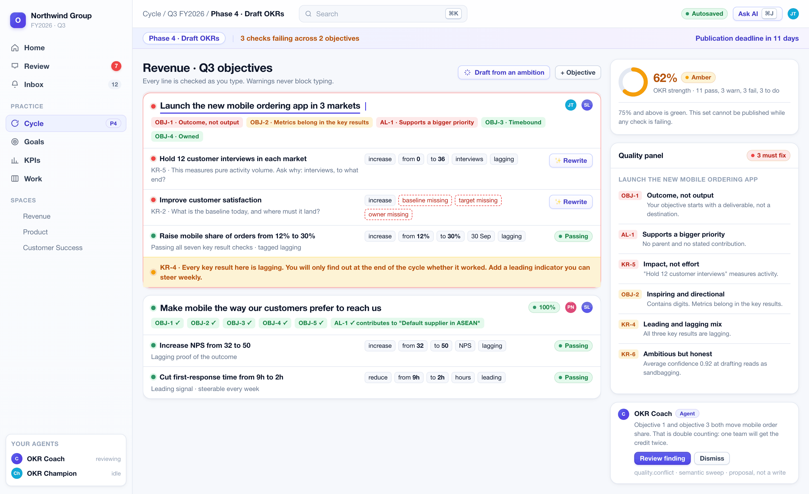
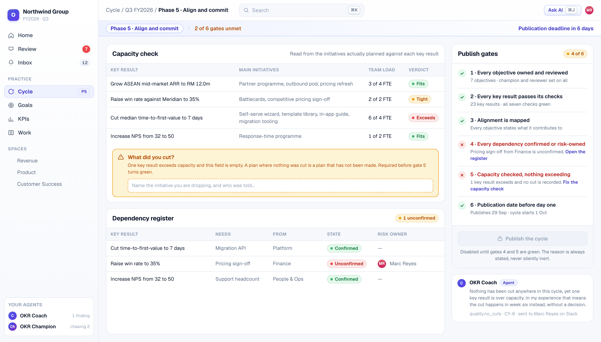
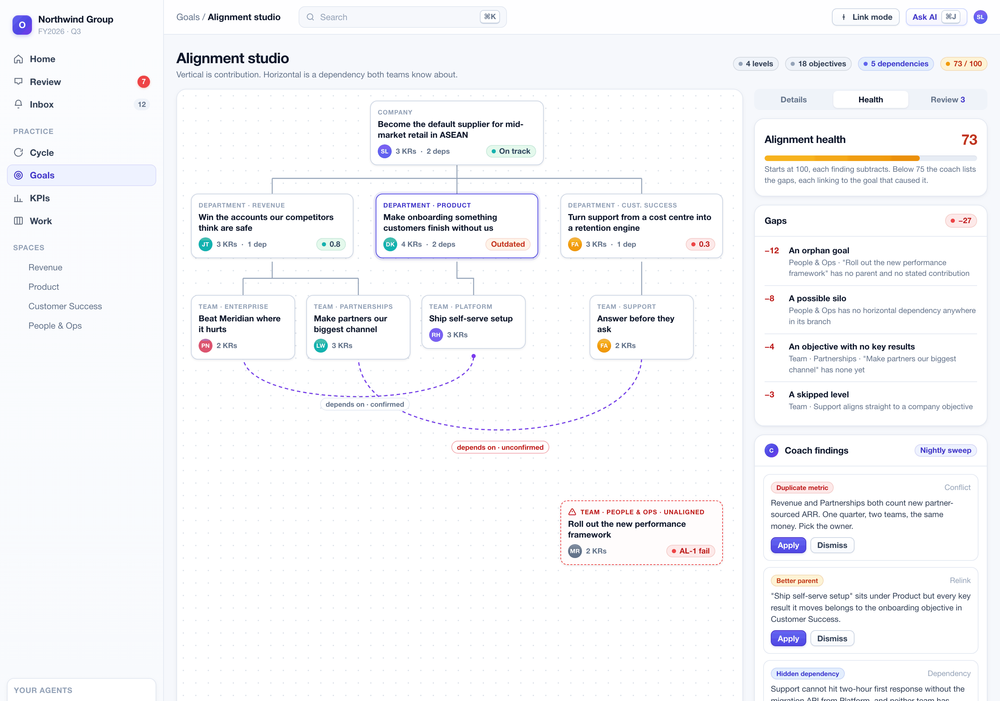
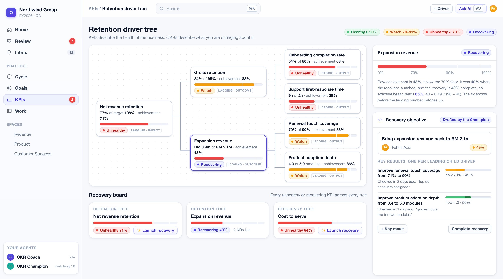
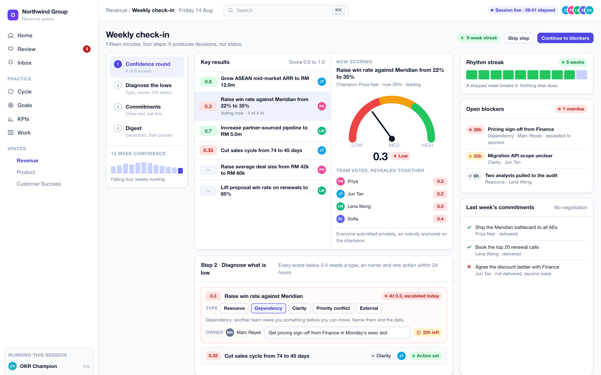

# 🎯 OpenOKR

### Your OKR coach, built in.

**Open source · AI-native · Self-hosted or in the cloud**

[Product overview (PDF)](docs/stakeholder/OpenOKR-Overview.pdf) ·
[Pitch deck (PDF)](docs/stakeholder/OpenOKR-Deck.pdf) ·
[The method](docs/development-plan/METHOD.md) ·
[The plan](docs/development-plan/) ·
[Live status](docs/development-plan/STATUS.md)

 

---

Most organisations do not fail at OKRs because their software was bad. They fail because the practice never happened. Somebody wrote objectives in a spreadsheet in January, nobody checked in by March, and the quarterly review was a meeting where everyone agreed things had gone reasonably well.

The practice that makes OKRs work has been understood for twenty years. It just does not live in the software.

| What organisations use today | Why the practice still dies |
|---|---|
| **Spreadsheets** | No cadence, no accountability, no quality bar. Nobody is ever told anything |
| **Conventional OKR trackers** | A database with a progress bar. They store objectives faithfully and are entirely passive |
| **Consulting and training** | The method is real, but it walks out of the door with the consultant. Nothing enforces it on a wet Tuesday in week six |

OpenOKR fixes this in two ways at once.

## ✨ What makes it different

### 1. The method is in the product

The full OKR practice ships as executable rules, not templates or help articles: a guided eight-phase cycle, twenty-six quality checks that run as you type, six hard publish gates, an alignment health score that names its own gaps, KPI health corridors with automatic recovery objectives, two timed session formats, and a diagnostic at the close.

The whole canon lives in [one specification](docs/development-plan/METHOD.md) and compiles into a pure library with no database, no network and no AI dependency. The same rules run in the browser as you type, on the server before any write, inside the agents, and in the importer. A conformance suite fails the build when the specification and the code disagree.

Every coaching message cites the rule behind it, so you can open the rule and argue with it. Nothing is a mysterious red dot.

### 2. The product is active

Two AI teammates ship with every workspace. They are members, not features: they have names, they appear in feeds, they can be mentioned, and they are accountable.

| Agent | Guards | What it actually does |
|---|---|---|
| 🧠 **OKR Coach** | Quality | Reviews every draft against the quality checks. Flags the task-shaped key result, the missing baseline, the empty not-doing list, the sandbagged confidence, and the goal reported on track whose numbers have not moved. Runs a nightly semantic sweep for duplicated metrics, better parents and hidden dependencies |
| ⏰ **OKR Champion** | Rhythm | Reminds the champion before a check-in is due and escalates visibly up a five-step ladder. Runs the blocker clock with a warning at twenty hours and an escalation at twenty-four. Opens and closes the weekly session, keeps the streak, watches every KPI corridor, and drafts the recovery objective when one drops out of range |

They reach you in the browser, in **Slack, Microsoft Teams, WhatsApp and Telegram**, by email, and through **your own AI agent**. Everything a human can do, an agent can do, through one permission-checked contract, so your Claude, ChatGPT or Cursor works as you, within your permissions, fully audited.

### And it all works with AI switched off

Every rule, nudge, escalation, gate, score, corridor and diagnostic is deterministic code, not a prompt. Turn the AI provider off and the coach still coaches. That makes OpenOKR fit for regulated, air-gapped and AI-sceptical environments that would reject an LLM-dependent product outright. AI adds drafting, rewriting, semantic judgement and language. It never makes the decision.

## 📸 A tour of the product

<b>Quality at the point of writing</b> — twenty-six checks judge every line as it is typed

 

Each check returns pass, warn or fail with a coaching prompt, the reason it matters and a weak-versus-strong example. The set carries a live strength score. "Hold twelve customer interviews" gets asked what the interviews are for. A target without a baseline gets told movement cannot be proved.

Every verdict opens into the rule itself. Coaching is arguable by design.

<b>Six publish gates, enforced</b> — a weak OKR set cannot be published

 

Every objective needs a champion and a reviewer. Every key result must pass its checks. Alignment must be mapped, dependencies confirmed or risk-owned, capacity checked with the cuts recorded, and a publication date set. Fail one and the publish control is disabled with the reason stated.

Gate five is the one most organisations have never had. A plan where nothing was cut is a plan that has not been made.

<b>The guided cycle</b> — eight phases with computed completion, not self-reported ticks

 

The product knows which phase it is in, what is missing, who owes what, and how many weeks remain. Drafting is refused until the input pack is complete, because a planning session without inputs produces objectives written from opinion.

<b>Alignment that means something</b> — contribution, not copying

 

Vertical alignment is contribution. Horizontal alignment is a dependency both teams know about. The product scores alignment health and names every gap, and the Coach's nightly sweep finds what structure alone cannot see.

<b>KPI corridors and recovery objectives</b> — the fix is visible before the number catches up

 

Every KPI sits in a health corridor. When one turns unhealthy, OpenOKR drafts a recovery objective, one key result per leading child driver. The KPI reads "recovering" and its effective health rises with the recovery's progress.

<b>The weekly and quarterly rhythm</b> — run by the product, not remembered by a person

 

The weekly session is fifteen to thirty minutes in four steps: a private confidence round revealed together, blockers typed against a five-item taxonomy with an owner and a twenty-four hour clock, commitments closed out loud, and a generated digest. It ends with a streak.

The quarterly review is sixty minutes, three acts, eleven timed stages, and it ends in a diagnosis: was the miss a strategy problem or a cadence problem? That is the one question every executive asks and no tracker answers.

<b>Accountability that reaches people</b> — the review inbox, and four chat channels

 

The review inbox says what you owe, computed on the server, overdue first. Every proactive message shows its provenance: which rule sent it, on which channel, and where it sits on the escalation ladder. A snooze quietens the message and never hides the obligation.

Every channel is two-way: nudges out, real work in. A check-in typed into WhatsApp runs through the same permission checks as a click in the browser.

## 🧩 Everything in the box

Nothing is gated behind a paid tier. See the [full module inventory](docs/stakeholder/OpenOKR-Overview.md) for the complete list.

| Pillar | What it holds |
|---|---|
| **The OKR core** | Annual and quarterly cycles, the eight guided phases, weighted direction-aware key results with baseline, history and a trend forecast, alignment with a dependency register, KPI driver trees with calculated formulas, health corridors and recovery boards, check-ins with immutable snapshots |
| **The rhythm** | The four-step weekly session, a five-type blocker taxonomy on a 24-hour clock, commitments, monthly reviews with a decision log, the eleven-stage quarterly review, staleness that overrides reported health, the review inbox and digests |
| **The work** | Initiatives that move a key result, a key-result-linked kanban board, rich documents with versions, and files. Deliberately OKR-shaped, not a project management suite |
| **Coaching and AI** | The twenty-six-check engine, both agents, propose-by-default governance with hard cost caps, a grounded copilot, and bring-your-own AI: Anthropic, OpenAI, Google, OpenRouter, Ollama or any compatible endpoint, including fully local |
| **Channels and reach** | Browser, email, Slack, Microsoft Teams, WhatsApp, Telegram, and an external agent surface with a consent screen and a full audited tool catalogue |
| **Platform** | Spaces, people and org chart, relationship-based access control, comments and notifications with quiet hours, a live activity feed, search, admin, a tamper-evident audit log, signed workspace export, spreadsheet and FlowyTeam importers, WCAG 2.1 AA target, English and Bahasa Melayu at launch |

## 🚀 Running it

| Option | Who it suits | What it takes |
|---|---|---|
| **Self-hosted, one server** | Any organisation that wants its data on its own machines | One Docker Compose file and a first-run web wizard. Target: under 30 minutes |
| **Self-hosted, Kubernetes** | Universities, government and large enterprises | A Helm chart, your PostgreSQL, your single sign-on, your backups |
| **Managed cloud** | Teams that do not want to run anything | Sign up, name a workspace, start |

Both come from the same tagged release. **Self-host is never seat-limited and never feature-gated. The cloud sells operation, not features.**

PostgreSQL is the only required service. Air-gapped installation is fully supported: a local AI model or none at all, self-hosted assets, and telemetry only if you opt in.

## 🛠 The stack

TypeScript in strict mode everywhere. Next.js App Router and React. PostgreSQL through Drizzle, with row-level security in the database as the tenant floor. Better Auth. Tailwind with shadcn/ui. Turborepo and pnpm. Vitest and Playwright.

| Principle | What it buys |
|---|---|
| **The method is a pure library** | The same rules everywhere, and a build that fails when code drifts from the specification |
| **One write path** | Every write is one transaction: the change, its audit row and its outbox row commit together |
| **Tenant isolation in the database** | Row-level security shipped in the same migration as every table. Application code cannot leak across tenants even if it is wrong |
| **One authorisation checkpoint** | Every read of a protected object goes through a single access-aware getter. No per-endpoint checks |
| **One contract, many surfaces** | The API, OpenAPI, the CLI, the agent tool catalogue and the chat commands are generated projections of one action registry, checked for drift in CI |
| **Vendor code is quarantined** | No vendor SDK outside one adapters package. That is what makes air-gapped operation real rather than aspirational |

## 🗺 Status and roadmap

The product is fully specified: requirements, architecture, the method canon, the complete database schema, the AI and agent design, forty screen specifications, and **104 scoped tasks across eight phases**, each with acceptance criteria and a test plan. Implementation is underway. Progress is tracked live in [STATUS.md](docs/development-plan/STATUS.md).

| Phase | What lands | |
|---|---|---|
| **1. Foundation** | Monorepo, CI, the tenant floor, adapter ports, the transactional outbox, auth, workspaces, the write pipeline, Compose and Helm | 🔨 In progress |
| **2. Platform and agent spine** | Access model, people, notifications, the design system, and the AI foundation with metering, caps and the agent runtime | ⏳ |
| **3. The OKR core** | Cycles, goals and key results, scoring and health engines, check-ins, alignment, KPIs and recovery, the Work Map | ⏳ |
| **4. The coaching layer** | The full rule catalogue, the Draft Coach, both agents, all three session formats, the diagnostic, the copilot | ⏳ |
| **5. Reach** | Slack, Teams, WhatsApp, Telegram, the external agent surface, initiatives, tasks, documents and search | ⏳ |
| **6. Data** | The importers, workspace export and import, backups with restore drills | ⏳ |
| **7. Hardening** | Performance, load and soak, the security review, the accessibility audit, observability | ⏳ |
| **8. Cloud and launch** | Tenant provisioning, SSO and directory sync, the air-gap guide, documentation, the hosted demo | ⏳ |

The order is deliberate. The agent foundation lands in phase two so the coaching layer can ship alongside the OKR core. An OKR tool where the coach arrives last is just another tracker.

## 📚 Documentation

| Read this | If you want |
|---|---|
| [**Product overview** (PDF)](docs/stakeholder/OpenOKR-Overview.pdf) · [source](docs/stakeholder/OpenOKR-Overview.md) | The complete product on paper: the problem, the method, every module, security, licensing and roadmap. Written for a partner, an investor or an early customer |
| [**Pitch deck** (PDF)](docs/stakeholder/OpenOKR-Deck.pdf) · [pptx](docs/stakeholder/OpenOKR-Deck.pptx) | The same story in 36 slides |
| [OVERVIEW.md](docs/development-plan/OVERVIEW.md) | The product explained for end users |
| [METHOD.md](docs/development-plan/METHOD.md) | The OKR practice canon: every rule, band, corridor, taxonomy and ritual the product encodes |
| [The development plan](docs/development-plan/) | Requirements, architecture, the technical design, the AI design, the UI specifications and the implementation plan |
| [STATUS.md](docs/development-plan/STATUS.md) | Live execution status across all 104 tasks |
| [CLAUDE.md](CLAUDE.md) | Working rules for the AI agent that builds it |

## 🤝 Working with us

Three different conversations, depending on who you are.

| If you are | The ask | What you get |
|---|---|---|
| **A methodology practitioner** | Review [the method](docs/development-plan/METHOD.md) and challenge any rule, threshold or agenda you think is wrong | Your practice becomes enforceable software, with every rule attributable, versioned and arguable |
| **An early customer or design partner** | Run a real quarter on it, with us, and tell us where the coaching is wrong | Free pilot use, direct influence on the rules, and no lock-in because the whole workspace exports at any time |
| **A contributor** | The build follows a strict [task loop](docs/development-plan/IMPLEMENTATION-PLAN.md) with tests first and a definition of done | A codebase where the interesting problems are method, coaching and agents, not CRUD |

## ⚖️ Licence

**AGPL-3.0** with a lightweight contributor licence agreement. See [PLAN.md §4](docs/development-plan/PLAN.md).

- AGPL stops a third party from selling a closed hosted version. Anyone who modifies it and offers it over a network must publish their changes.
- An organisation that self-hosts for its own staff takes on no obligations at all.
- The methodology is implemented in our own words. No third party's copy, branding or course material appears in the product.

---

**The practice, inside the product.** ⭐ Star the repository to follow the build.

