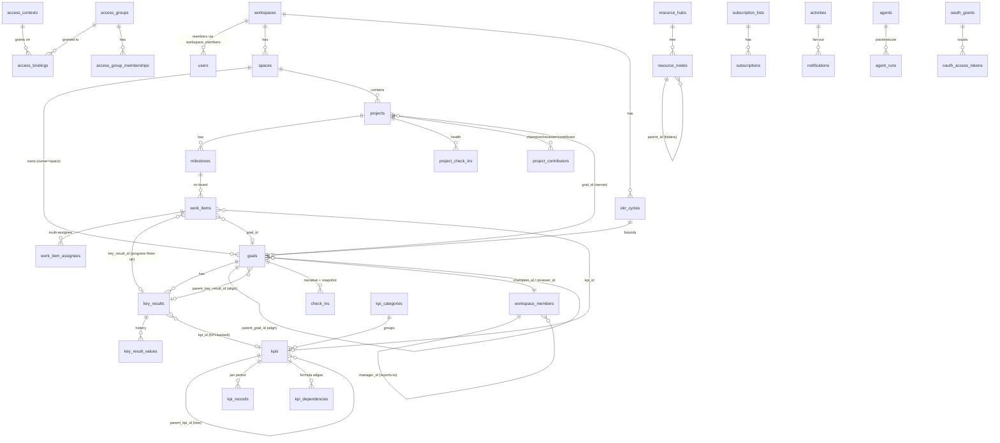

# DATABASE.md

The full OpenOKR database structure in one place — every table, its key columns, foreign keys, enums and relationships.

**This is a consolidated reference view.** The authority is `TECHNICAL-PLAN.md §4` (platform + strategy + execution) and `AI-NATIVE-PLAN.md §7` (the AI domain). When those change, update this file in the same PR. The actual Drizzle schema in `packages/db` is generated from the authorities, not from this doc.

---

## 1. Conventions (apply to every table unless noted)

| Rule | Detail |
|---|---|
| Primary key | `id uuid` v7 (time-ordered, app-generated) — internal only. |
| Public id | `short_id` (random base58, unique per workspace) on externally addressable aggregates — used in URLs/REST/MCP/CLI. Internal v7 ids are never exposed; a bad/unknown public id returns 404. |
| Tenancy | `workspace_id uuid` on every business table + an RLS policy in the same migration, keyed on the `app.workspace_id` GUC (set `SET LOCAL` per transaction). **Exceptions:** `workspaces` (tenant root), `users` (global), `ai_models` (global catalog). |
| Timestamps | `created_at`, `updated_at`. |
| Import provenance | `legacy_id bigint?` + `legacy_type text?` (`flowyteam` / `csv`), unique `(workspace_id, legacy_type, legacy_id)`. Only on importable tables. |
| Enums | TypeScript string unions stored as `text` with a `CHECK` constraint. |
| Soft delete | `deleted_at timestamptz?` where deletion must be reversible; a **repo-wide default scope** injects `deleted_at IS NULL` (explicit `withDeleted()` opt-in; CI-linted). |
| Rich text | ProseMirror/TipTap **JSON** in `jsonb` + `version int`. Columns marked *(rich)*. Never Markdown-as-storage. |
| Derived | Marked *(derived)*. Computed by an engine/job via the outbox; recomputed on import; never trusted from source. |
| Optimistic locking | `version int` on user-editable aggregates. |
| Credentials/sessions | Owned by **Better Auth** (users' passwords, sessions [hashed], passkeys, TOTP). Not modeled here; `users` links by id. |
| Every write | Goes through the Operation pipeline: mutation + `access_bindings` + `activities` + `audit_events` + `outbox` in one transaction (TECHNICAL-PLAN §8.1). |

Column tables list **domain columns only** — assume `id`, `workspace_id`, `created_at`, `updated_at` (and `short_id`/`legacy_*`/`version` where noted). `→ table` is a foreign key; `?` is nullable.

---

## 2. Domain map

| # | Domain | Tables | Authority |
|---|---|---|---|
| A | Identity & access | `workspaces`, `users`, `workspace_members`, `access_contexts`, `access_groups`, `access_group_memberships`, `access_bindings`, `invite_links`, `audit_events`, `outbox`, `system_settings` | TECHNICAL-PLAN §4.1 |
| B | Spaces | `spaces`, `space_members` | §4.2 |
| C | Strategy: cycles & goals | `okr_cycles`, `strategy_settings`, `goals`, `key_results`, `key_result_values`, `check_ins`, `goal_retrospectives` | §4.3 |
| D | KPIs & scorecard | `kpi_categories`, `kpis`, `kpi_records`, `kpi_dependencies`, `kpi_shares`, `performance_snapshots`, `scorecard_settings`, `score_entries` | §4.4 |
| E | Execution | `projects`, `project_contributors`, `project_check_ins`, `project_retrospectives`, `milestones`, `work_items`, `work_item_assignees`, `checklist_items`, `work_item_relations`, `reminders`, `time_entries` | §4.5 |
| F | Resource Hub | `resource_hubs`, `resource_nodes`, `documents`, `files`, `links` | §4.6 |
| G | Collaboration | `discussions`, `comments`, `reactions`, `subscription_lists`, `subscriptions` | §4.7 |
| H | Feed & notifications | `activities`, `notifications`, `notification_email_batches`, `notification_settings` | §4.8 |
| I | Attachments | `blobs` | §4.9 |
| J | Importer & portability | `import_runs`, `export_runs`, `workspace_imports` | §4.10 |
| M | AI | `ai_providers`, `ai_credentials`, `ai_models`*, `ai_model_policies`, `ai_feature_settings`, `ai_prompts`, `ai_threads`, `ai_messages`, `ai_tool_calls`, `ai_usage_events`, `embeddings`, `agents`, `agent_runs`, `proposed_changes` | AI-NATIVE-PLAN §7 |
| N | MCP OAuth | `oauth_clients`, `oauth_grants`, `oauth_codes`, `oauth_access_tokens`, `oauth_refresh_tokens`, `mcp_sessions` | AI-NATIVE-PLAN §5.2/§7 |

`ai_models` is a **global** catalog (no `workspace_id`). Domain M/N tables carry no legacy provenance. `ai_credentials` and every token hash are never selected to the client. `embeddings` uses **pgvector** (a Postgres extension — no new service).

---

## 3. Relationship map (core spine)

The **two load-bearing joins:** ownership (`champion_id`/`reviewer_id` on goals & projects — the accountability contract, distinct from access roles) and the strategy↔execution link (`work_items.key_result_id`/`.goal_id`/`.kpi_id` + `key_results.kpi_id`, so closing work moves the goal). Ownership shorthand across strategy: **`owner`** ∈ `workspace` / `space` / `member`, with nullable `space_id → spaces` and `member_id → workspace_members`.

---

## 4. Identity & access (domain A)

### workspaces *(tenant root — no workspace_id)*
`name`, `slug` (unique), `state` (`active`/`read_only`/`frozen`), `settings jsonb` (brand color, trusted_email_domains, cadence defaults, storage bytes + quota).

### users *(global — no workspace_id; Better Auth owns credentials/sessions/passkeys/TOTP)*
`email` (unique). Everything person-facing lives on `workspace_members`.

### workspace_members
`user_id? → users` (null for placeholders/agents pre-claim), `name`, `title?`, `avatar_blob_id?`, `timezone?`, `bio` *(rich)*, `manager_id? → workspace_members` (cycle-safe reports-to), `kind` (`human`/`guest`/`ai`/`placeholder`), `status` (`active`/`invited`/`suspended`), `suspended_at?`. All authorship/mentions/assignments/audit reference the member.

### access_contexts
`resource_type` (`space`/`goal`/`project`/`resource_hub`/`discussion`/…), `resource_id`. One per protected aggregate.

### access_groups
`kind` (`member`/`workspace_standard`/`space_standard`/`anonymous`), `member_id? → workspace_members`, `space_id? → spaces`.

### access_group_memberships
`group_id → access_groups`, `member_id → workspace_members`.

### access_bindings
`group_id → access_groups`, `context_id → access_contexts`, `level` (`view`=10/`comment`=40/`edit`=70/`full`=100), `tag?` (`champion`/`reviewer`). Effective access = max(level) over reachable bindings; privacy labels are derived from which group tiers hold a binding.

### invite_links
`token_hash`, `mode` (`workspace`/`personal`), `member_id?`, `allowed_domains text[]?`, `use_count`, `max_uses?`, `expires_at?`, `revoked_at?`.

### audit_events *(append-only; no UPDATE/DELETE grants)*
`actor_member_id? → workspace_members`, `action`, `target_type`, `target_id`, `payload jsonb` (typed per action), `at`, `prev_hash`, `row_hash` (per-workspace hash chain). Written in the mutating transaction; reads are ACL-scoped.

### outbox
`topic`, `payload jsonb`, `idempotency_key`, `created_at`, `delivered_at?`, `attempts`. The only legal enqueue on a write path; a relay drains committed rows to JobQueue/Realtime/Mailer.

### system_settings *(singleton)*
Email delivery config with encrypted secrets (AES-GCM envelope, key ring); instance flags. Admin-editable; env is bootstrap/override.

---

## 5. Spaces (domain B)

### spaces
`name`, `mission?`, `settings jsonb`. Each owns an access context + a `space_standard` group.

### space_members
`space_id → spaces`, `member_id → workspace_members`, `role` (`member`/`manager`). Manager implies the space `full` binding.

---

## 6. Strategy: cycles & goals (domain C)

### okr_cycles
`name`, `cadence` (`annual`/`semiannual`/`quarterly`/`monthly`), `starts_on`, `ends_on`, `status` (`upcoming`/`active`/`closed`), `previous_cycle_id?`. Generated forward from the cadence.

### strategy_settings *(one row per workspace)*
`default_check_in_frequency` (`weekly`/`biweekly`/`monthly`), `check_in_anchor_day` (default Friday), `staleness_grace_days` (default 3), `rag_fail_pct` (50), `rag_pass_pct` (75), `max_goals_per_owner?`, `labels jsonb` (term overrides).

### goals *(short_id; importable)*
| Column | Type | Notes |
|---|---|---|
| `title` | text | |
| `description?` | jsonb *(rich)* | |
| `cycle_id?` | uuid → okr_cycles | |
| `timeframe?` | jsonb | `{start,end,granularity: day\|month\|quarter\|year, label}`; defaults to cycle bounds |
| `owner` | text | `workspace`/`space`/`member` |
| `space_id?` / `member_id?` | uuid | → spaces / workspace_members |
| `champion_id` | uuid → workspace_members | required (accountable owner) |
| `reviewer_id` | uuid → workspace_members | required (acknowledges check-ins) |
| `parent_goal_id?` / `parent_key_result_id?` | uuid | alignment; at most one set; cycles prevented |
| `weight` | numeric | 1–100 |
| `check_in_frequency` | text | overrides the workspace default |
| `next_check_in_at` | timestamptz | never null while open; advanced on publish |
| `last_check_in_id?` | uuid → check_ins | |
| `closed_at?` / `closed_by_id?` | | explicit close |
| `success_status?` | text | `achieved`/`missed` |
| `progress_pct` | numeric *(derived)* | weighted, incl. aligned children |
| `health` | text *(derived)* | precedence cascade: success → outdated → last check-in → pending |
| `ai_generated` / `ai_source_id?` | | AI provenance |
| `position` | int | |

### key_results *(importable)*
`goal_id → goals`, `title`, `unit`, `direction` (`increase`/`decrease`), `initial_value numeric`, `target_value numeric`, `current_value numeric`, `progress_pct` *(derived, capped 0–100)*, `weight numeric`, `kpi_id? → kpis` (KPI-backed), `position`.

### key_result_values *(history)*
`key_result_id → key_results`, `value numeric`, `at`, `author_member_id → workspace_members`, `check_in_id? → check_ins`. Drives sparklines + trend forecast.

### check_ins
`goal_id → goals`, `author_member_id`, `state` (`draft`/`published`), `published_at?`, `status` (`on_track`/`caution`/`off_track`), `confidence smallint?` (0–10), `narrative jsonb (rich)` (required to publish), `snapshot jsonb` (immutable: every KR `{id,value,previous_value,progress_pct}` + checklist at publish), `acknowledged_by_id? → workspace_members`, `acknowledged_at?`. Drafts emit nothing and don't advance the cadence; publish advances `next_check_in_at`; delete rolls goal pointers back.

### goal_retrospectives
`goal_id → goals`, `body jsonb (rich)`, `author_member_id`. Created at close; kept on reopen.

---

## 7. KPIs & scorecard (domain D)

### kpi_categories
`name`.

### kpis *(short_id; importable)*
`category_id → kpi_categories`, `title`, `description? (rich)`, `owner`/`space_id?`/`member_id?`, `frequency` (`daily`/`weekly`/`monthly`/`quarterly`/`yearly`), `unit`, `direction` (`higher_better`/`lower_better`), `target_default? numeric`, `aggregate` (`sum`/`avg`/`max`/`min`/`count`), `is_calculated bool`, `formula? jsonb` (typed expression tree, no eval), `rag_fail_pct`/`rag_pass_pct`, `parent_kpi_id?`, `starts_on?`/`ends_on?`.

### kpi_records
`kpi_id → kpis`, `period_start date` (normalized bucket), `target_value? numeric`, `actual_value? numeric`, `remark?`, `author_member_id`. **Unique `(workspace_id, kpi_id, period_start)`.**

### kpi_dependencies
`kpi_id → kpis`, `depends_on_kpi_id → kpis`. Formula edges; cascade recompute (cycle-checked).

### kpi_shares
`kpi_id → kpis`, `member_id → workspace_members`, `access` (`read`/`update`).

### performance_snapshots
`owner`/`space_id?`/`member_id?`, `cycle_id → okr_cycles`, `result_value numeric`, per-bucket goal/KR counts (completed/on_track/at_risk/outdated). Recomputed on archive.

### scorecard_settings / score_entries
As before; **points off by default**, human-gated; only imported if funded.

---

## 8. Execution (domain E)

### projects *(short_id; importable)*
`space_id → spaces`, `name`, `description? (rich)`, `goal_id? → goals` (serves), `state` (`active`/`paused`/`closed`), `paused_at?`, `closed_at?`, `success_status?` (`achieved`/`missed`), `check_in_frequency`, `next_check_in_at`, `last_check_in_id?`, `health` *(derived)*, `next_step` *(derived: earliest-due open milestone)*.

### project_contributors
`project_id → projects`, `member_id → workspace_members`, `role` (`champion`/`reviewer`/`contributor`), `responsibility?`. Champion/reviewer unique per project; lockstep with tagged bindings; person-swap downgrades the outgoing holder.

### project_check_ins
`project_id → projects`, `author_member_id`, `state`, `published_at?`, `status` (`on_track`/`caution`/`off_track`), `narrative jsonb (rich)`, `snapshot jsonb` (milestone states), `acknowledged_by_id?`/`_at?`.

### project_retrospectives
`project_id → projects`, `body jsonb (rich)`, `author_member_id`. Required at close.

### milestones
`project_id → projects`, `title`, `description? (rich)`, `timeframe jsonb`, `status` (`open`/`done`), `completed_at?`, `position`, `ordering_state jsonb` (kanban order, normalized, row-locked on write).

### work_items *(short_id; importable)*
`project_id → projects`, `milestone_id? → milestones`, `title`, `description (rich)`, `status` (`todo`/`in_progress`/`done`/`canceled`), `due? jsonb` (contextual), `key_result_id? → key_results`, `goal_id? → goals`, `kpi_id? → kpis`, `position`, `version int`.

### work_item_assignees
`work_item_id → work_items`, `member_id → workspace_members`. Multi-assignee; assignment grants edit access.

### checklist_items
`work_item_id → work_items`, `title`, `assignee_id?`, `done bool`, `position`. No rollup.

### work_item_relations
`from_id → work_items`, `to_id → work_items`, `kind` (`blocks`). Cannot-complete-while-blocked guard.

### reminders
`work_item_id → work_items`, `member_id → workspace_members`, `kind` (`on_date`/`before_due`/`on_due`/`overdue`), `offset_days?`, `remind_at?`. Relative kinds require a due date; auto-stripped if due removed.

### time_entries *(import-preservation only in v1)*
`work_item_id? → work_items`, `project_id → projects`, `member_id`, `hours numeric`, `spent_on date`, `comment?`. Read-only display in v1; tracking UI is post-v1.

---

## 9. Resource Hub (domain F)

### resource_hubs
`owner_type` (`space`/`project`/`goal`), `owner_id`, `name`. Inherits the owner's access context.

### resource_nodes
`hub_id → resource_hubs`, `parent_id? → resource_nodes` (folder tree), `type` (`document`/`folder`/`file`/`link`), `name`, `position`.

### documents
`node_id → resource_nodes`, `body jsonb (rich)`, `state` (`draft`/`published`), `published_at?`, `author_member_id`. Drafts author-private (enforced in the getter); publish emits the activity; version history + diff via `version` + activities.

### files
`node_id → resource_nodes`, `blob_id → blobs`, `preview_blob_id?`, `width?`, `height?`.

### links
`node_id → resource_nodes`, `url`, `provider` (`google_doc`/`google_sheet`/`google_slides`/`figma`/`notion`/`airtable`/`dropbox`/`other`), `description? (rich)`, `preview jsonb?` (SSRF-safe enrichment).

---

## 10. Collaboration (domain G)

### discussions *(short_id)*
`space_id? → spaces` OR (`subject_type`, `subject_id`) anchor, `title`, `body jsonb (rich)`, `author_member_id`, `state` (`draft`/`published`), `published_at?`. Space-scoped = board/announcements; anchored = goal/project discussion. Drafts silent.

### comments
`subject_type`, `subject_id` (work_item/milestone/check_in/project_check_in/discussion/document/file/link/goal/retrospective), `author_member_id`, `body jsonb (rich)`, `edited_at?`, `action?` (`complete_milestone`/`reopen_milestone`). Deep-linkable (`#comment-<short_id>`).

### reactions
`subject_type`, `subject_id`, `member_id`, `emoji`. On all major subjects.

### subscription_lists
`subject_type`, `subject_id`, `send_to_everyone bool`. One per notifiable artifact.

### subscriptions
`list_id → subscription_lists`, `member_id → workspace_members`, `reason` (`invited`/`joined`/`mentioned`), `canceled bool`. Unique (list, member). Authors auto-`joined`; mentions auto-`mentioned` and re-diffed on edit; suspended/placeholder/`ai` excluded at the join.

---

## 11. Feed & notifications (domain H)

### activities
`kind` (typed catalog: `goal.created`/`goal.checked_in`/`goal.closed`/`check_in.acknowledged`/`project.paused`/`milestone.completed`/`member.joined`/`document.published`/…), `payload jsonb` (Zod-validated per kind; snapshots human labels), `actor_member_id`, `subject_type`, `subject_id`, `space_id?`, `context_id → access_contexts` (feed access scope), `at`. Written in-transaction; feeds filter by the requester's access to `context_id`; consecutive same-actor edits aggregated; live via Realtime.

### notifications
`recipient_member_id → workspace_members`, `activity_id → activities`, `reason`, `read_at?`, `should_send_email bool`, `email_batch_id? → notification_email_batches`, `email_sent_at?`. Recipients resolved from subscriptions + assignment/mention/review reasons, **access-checked at send time**, author excluded.

### notification_email_batches
`member_id → workspace_members`, `status` (`scheduled`/`sending`/`sent`/`failed`/`skipped`), `window_minutes`, `send_at`, `sent_at?`, `error?`. Find-or-create under a row lock; idempotent worker.

### notification_settings
`member_id → workspace_members`, per-reason channel routing jsonb, `mention_immediate bool`, `email_window_minutes`, `send_daily_summary bool`, `daily_summary_time`. Daily summary fires in the member's own timezone (validated against `pg_timezone_names`, UTC fallback, DST-correct).

---

## 12. Attachments (domain I)

### blobs
`filename`, `content_type`, `filesize bigint`, `digest`, `storage_key`, `author_member_id`, `status` (`ok`/`scanning`/`quarantined`), `width?`, `height?`. Bytes behind the FileStorage adapter; prepare → upload → claim on save; orphan cleanup job. Per-workspace byte total + quota + once-at-90% warning enforced on upload-finish.

---

## 13. Importer & portability (domain J)

### import_runs
`source` (`flowyteam`/`csv`), `mode` (`dry_run`/`real`), `status`, `report jsonb` (counts, skips, lossy items, reconciliation), `started_at`, `finished_at?`.

### export_runs / workspace_imports
Archive manifest, checksum, status, progress for the workspace export/import portability engine (TECHNICAL-PLAN §7.3). Excludes secrets/sessions/tokens/audit chain.

---

## 14. AI (domain M) & MCP OAuth (domain N)

Full detail in `AI-NATIVE-PLAN.md §7`. Summary:

- **M:** `ai_providers`, `ai_credentials` (envelope-encrypted; never to client), `ai_models` *(global)*, `ai_model_policies` (tier→model), `ai_feature_settings`, `ai_prompts` (versioned; per feature or per agent+phase), `ai_threads`/`ai_messages`, `ai_tool_calls` (+ `run_id`), `ai_usage_events` (metering spine — drives quotas/caps), `embeddings` (pgvector/HNSW), `agents` (member_id, definition, planning/execution instructions, provider/tier, schedule, autonomy `sandbox`/`batch_approval`/`scoped_direct`), `agent_runs` (status machine, tasks jsonb, append-only logs, cost), `proposed_changes` (batch-approval envelopes: run_id, action, payload, status).
- **N:** `oauth_clients` (registered + CIMD cache), `oauth_grants` (member+workspace+client, revoked_at), `oauth_codes` (hash, PKCE challenge, resource, consumed_at), `oauth_access_tokens`/`oauth_refresh_tokens` (hashes, resource/audience, expiry, rotation lineage), `mcp_sessions` (grant_id, protocol_version, closed_at).

---

## 15. Cross-domain relationship summary

| From | Column | To | Meaning |
|---|---|---|---|
| everything | `workspace_id` | `workspaces` | tenant isolation (RLS floor) |
| protected aggregates | via `access_contexts`+`access_bindings` | `access_groups` | object authorization (`can()`) |
| `goals`/`projects` | `champion_id` / `reviewer_id` | `workspace_members` | the accountability contract |
| `work_items` | `key_result_id` / `goal_id` / `kpi_id` | `key_results` / `goals` / `kpis` | execution drives strategy |
| `key_results` | `kpi_id` | `kpis` | a KR measured by a live KPI |
| `goals` | `parent_goal_id` / `parent_key_result_id` | `goals` / `key_results` | alignment cascade |
| `goals`/`kpis` | `owner`+`space_id`/`member_id` | `spaces` / `workspace_members` / (workspace) | ownership scope |
| `check_ins` | `goal_id` (+ snapshot) | `goals`, `key_results` | dated narrative + immutable value snapshot |
| `activities` | `context_id` | `access_contexts` | permission-filtered feeds |
| `notifications` | `recipient_member_id` + access check | `workspace_members` | access-gated fan-out |
| `agents` | `member_id` | `workspace_members` | AI teammate as a first-class member |

---

## 16. Notes for implementation

- **RLS floor + relationship layer.** A CI check fails any `CREATE TABLE` on a business table without an RLS policy in the same file. RLS is the tenant boundary; object authorization is the §4.1 relationship model through one `can()` and one access-aware getter (not-found on forbidden; suspended excluded). Neither replaces the other (TECHNICAL-PLAN §8.1).
- **Three pure engines** in `packages/core`: goal health & scoring (precedence cascade + weighted rollup + trend forecast, §6.1), cadence (§6.2), KPI formulas (§6.3). Derived columns are recomputed by outbox-driven jobs, never per-row at render.
- **Every write is one transaction** through the Operation pipeline (mutation + bindings + activity + audit + outbox). Side effects are outbox-relayed after commit.
- **Indexes ship with the feature** (TECHNICAL-PLAN §13.2): every filterable/sortable column and FK; composite `(workspace_id, space_id, common-filter)`; `kpi_records` unique `(workspace_id, kpi_id, period_start)`; `next_check_in_at` indexed for the review inbox and staleness sweeps.
- **Import provenance** lets FlowyTeam and CSV rows coexist: `legacy_type` distinguishes them. Mapping: TECHNICAL-PLAN §7.2.
- **Soft-delete default scope** and the **data-change runner** (frozen-schema backfills, separate from DDL) are repo-wide conventions in `packages/db`.
