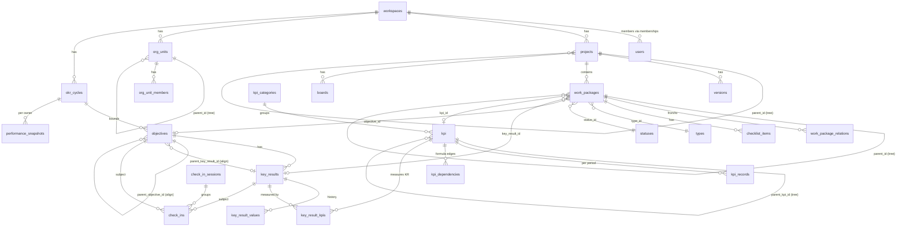

# DATABASE.md

The full OpenOKR database structure — every table, its key columns, foreign keys, enums, and relationships — in one place.

**This is a consolidated reference view.** The authoritative schema definitions live in `TECHNICAL-PLAN.md §4` (platform + work management) and `TECHNICAL-PLAN.md §4.12` (strategy: OKR/KPI/check-ins). When those change, update this file in the same PR. The actual Drizzle schema in `packages/db` is generated from those authorities, not from this doc.

---

## 1. Conventions (apply to every table unless noted)

| Rule | Detail |
|---|---|
| Primary key | `id uuid` (v7, time-ordered, app-generated). |
| Tenancy | `workspace_id uuid` on every business table + a Row Level Security policy in the same migration, keyed on the `app.workspace_id` GUC. **Exceptions:** `workspaces` (it is the tenant root) and `users` (global to the deployment). |
| Timestamps | `created_at`, `updated_at`. |
| Import provenance | `legacy_id bigint?` + `legacy_type text?` (`openproject` / `flowyteam`), unique `(workspace_id, legacy_type, legacy_id)` so re-imports upsert and both sources coexist. |
| Enums | TypeScript string unions stored as `text` with a `CHECK` constraint (not integer codes). Values listed per column below. |
| Soft delete | `deleted_at timestamptz?` where the source has it or deletion must be reversible. |
| Rich text | Markdown stored with a `format` tag + `version int` (co-edit-ready). Columns marked *(rich)*. |
| Derived columns | Marked *(derived)*. Computed by an engine/job, recomputed on import — never trusted from source. |
| Optimistic locking | `lock_version int` on user-editable aggregates (work packages). |
| Credentials/sessions | Owned by **Better Auth** in its own tables (users' passwords, sessions, MFA, tokens). Not modeled here; `users` links to them by id. |

Column tables below list **domain columns only** — assume `id`, `workspace_id`, `created_at`, `updated_at`, `legacy_id`, `legacy_type` are present per the rules above. `→ table` means a foreign key. `?` means nullable.

---

## 2. Domain map

| # | Domain | Tables | Authority |
|---|---|---|---|
| A | Identity & access | `workspaces`, `users`, `groups`, `group_members`, `memberships`, `roles`, `membership_roles`, `role_permissions`, `audit_events` | TECHNICAL-PLAN §4.1 |
| B | Org units (OKR/KPI owners) | `org_units`, `org_unit_members`, `org_unit_hierarchy` | TECHNICAL-PLAN §4.12.1 |
| C | Projects & versions | `projects`, `project_enabled_modules`, `project_hierarchy`, `versions`, `categories` | TECHNICAL-PLAN §4.2 |
| D | Work packages (incl. tasks) | `work_packages`, `work_package_versions`, `work_package_hierarchy`, `work_package_relations`, `work_package_watchers`, `types`, `statuses`, `workflows`, `priorities`, `checklist_items` | TECHNICAL-PLAN §4.3, TECHNICAL-PLAN §4.12.7 |
| E | Custom fields | `custom_fields`, `custom_field_options`, `custom_field_values`, `custom_field_activations`, `custom_field_sections` | TECHNICAL-PLAN §4.4 |
| F | Queries & views | `queries`, `views`, `query_orderings` | TECHNICAL-PLAN §4.5 |
| G | History, comments, notifications | `comments`, `activities`, `reactions`, `notifications`, `notification_settings`, `reminders` | TECHNICAL-PLAN §4.6 |
| H | Time, cost, budgets | `time_entries`, `time_entry_activities`, `cost_types`, `cost_entries`, `rates`, `budgets`, `budget_items` | TECHNICAL-PLAN §4.7 |
| I | Collaboration | `wikis`, `wiki_pages`, `forums`, `messages`, `news`, `documents`, `meetings`, `meeting_sections`, `meeting_agenda_items`, `meeting_participants`, `recurring_meetings` | TECHNICAL-PLAN §4.8 |
| J | Attachments & storages | `attachments`, `external_storages`, `project_storages`, `file_links` | TECHNICAL-PLAN §4.9 |
| K | Boards & dashboards | `boards`, `board_columns`, `dashboards`, `dashboard_widgets` | TECHNICAL-PLAN §4.10 |
| L | Integrations | `github_links`, `gitlab_links`, `webhooks`, `webhook_deliveries` | TECHNICAL-PLAN §4.11 |
| M | Backlogs, favorites, phases | `sprints`, `sprint_goals`, `backlog_buckets`, `favorites`, `project_phases`, `project_phase_definitions` | IMPLEMENTATION-PLAN P3-T28/T31/T33 |
| **N** | **OKR cycles & settings** | `okr_cycles`, `performance_settings` | TECHNICAL-PLAN §4.12.2 |
| **O** | **Objectives & key results** | `objectives`, `key_results`, `key_result_values` | TECHNICAL-PLAN §4.12.3 |
| **P** | **KPIs** | `kpi_categories`, `kpi`, `kpi_records`, `kpi_dependencies`, `key_result_kpis`, `kpi_shares` | TECHNICAL-PLAN §4.12.4 |
| **Q** | **Check-ins** | `check_in_sessions`, `check_ins`, `check_in_reviews` | TECHNICAL-PLAN §4.12.5 |
| **R** | **Scorecard** | `performance_snapshots`, `scorecard_settings`, `score_entries` | TECHNICAL-PLAN §4.12.6 |
| **S** | **AI layer** | `ai_providers`, `ai_credentials`, `ai_models`, `ai_model_policies`, `ai_feature_settings`, `ai_prompts`, `ai_threads`, `ai_messages`, `ai_tool_calls`, `ai_usage_events`, `embeddings` | AI-NATIVE-PLAN §7 |

Domain S tables are **new (no legacy source)** — they carry no `legacy_id`/`legacy_type`. `ai_models` is a **global** catalog (no `workspace_id`); every other domain-S table is workspace-scoped with RLS. `ai_credentials` is never selected to the client. `embeddings` uses the **pgvector** Postgres extension, so no new service is added.

---

## 3. Relationship map (core spine)

Ownership shorthand used throughout the strategy domain: **`owner_type`** ∈ `workspace` / `team` / `user`, with nullable `team_id → org_units` and `user_id → users`. Exactly one of `team_id`/`user_id` is set for `team`/`user`; both null for `workspace`.

The **join between the two pillars** is the work package: `work_packages.objective_id`, `.key_result_id`, `.kpi_id` link execution to strategy, and `key_results.work_package_id` lets a KR be driven by a single work package.

---

## 4. Identity & access (domain A)

### workspaces  *(tenant root — no `workspace_id`)*
| Column | Type | Notes |
|---|---|---|
| `name` | text | |
| `slug` | text | unique |
| `settings` | jsonb | brand color, defaults, feature flags |

### users  *(global to the deployment — no `workspace_id`; Better Auth owns credentials)*
| Column | Type | Notes |
|---|---|---|
| `email` | text | unique |
| `name` | text | |
| `kind` | text | `user` / `placeholder` |
| `status` | text | `active` / `registered` / `locked` / `invited` |
| `locale` | text | |
| `timezone` | text | |

### groups
`name`. A principal that can hold memberships.

### group_members
`group_id → groups`, `user_id → users`.

### memberships
Grants a principal access to a scope.
| Column | Type | Notes |
|---|---|---|
| `principal_id` | uuid | → users or groups |
| `principal_kind` | text | `user` / `group` |
| `project_id?` | uuid | → projects (project membership) |
| `shared_entity_type?` | text | for object sharing (e.g. `work_package`) |
| `shared_entity_id?` | uuid | the shared object |

### roles
Roles are configurable data (permissions attached per role), not a fixed enum.
| Column | Type | Notes |
|---|---|---|
| `name` | text | |
| `scope` | text | `project` / `global` / `work_package` |
| `builtin` | text | `none` / `non_member` / `anonymous` |

**Seeded defaults** (P2-T01): **Owner**, **Project admin**, **Member**, **Reader**, plus the builtin **Non-member** and **Anonymous** pseudo-roles. `work_package`-scope roles (view / comment / edit) back single-work-package sharing.

### membership_roles
`membership_id → memberships`, `role_id → roles`, `inherited_from_membership_id? → memberships` (group inheritance; recomputed, not imported).

### role_permissions
`role_id → roles`, `permission text` (one row per permission). Permission catalogue in `reference/legacy-feature-inventory.md` §2 plus the OKR/KPI set in TECHNICAL-PLAN.md §4.12.8 (`view_objectives`, `manage_objectives`, `check_in_objectives`, `view_kpis`, `manage_kpis`, `record_kpi_values`, `manage_cycles`, …).

### audit_events  *(append-only; no UPDATE/DELETE grants)*
`actor_id → users`, `action text`, `target_type text`, `target_id uuid`, `payload jsonb`, `at timestamptz`.

---

## 5. Org units (domain B) — OKR/KPI owners

### org_units
Teams and departments as one tree (maps FlowyTeam `teams`).
| Column | Type | Notes |
|---|---|---|
| `name` | text | |
| `kind` | text | `team` / `department` |
| `parent_id?` | uuid | → org_units (tree) |
| `lead_id?` | uuid | → users |
| `settings` | jsonb | e.g. default check-in visibility |

### org_unit_members
`org_unit_id → org_units`, `user_id → users`, `role text` (`member` / `lead`).

### org_unit_hierarchy  *(optional closure table)*
`ancestor_id → org_units`, `descendant_id → org_units`, `depth int`.

---

## 6. Projects & versions (domain C)

### projects
| Column | Type | Notes |
|---|---|---|
| `name` | text | |
| `identifier` | text | unique slug |
| `parent_id?` | uuid | → projects (tree) |
| `public` | bool | |
| `archived` | bool | |
| `templated` | bool | is a template |
| `status` | text | project status |
| `status_explanation?` | text *(rich)* | |
| `settings` | jsonb | |

### project_enabled_modules
`project_id → projects`, `module text` (feature toggle per project).

### project_hierarchy  *(closure)*
`ancestor_id → projects`, `descendant_id → projects`, `depth int`.

### versions  *(milestones / release targets)*
| Column | Type | Notes |
|---|---|---|
| `project_id` | uuid | → projects |
| `name` | text | |
| `status` | text | `open` / `locked` / `closed` |
| `sharing` | text | `none` / `descendants` / `hierarchy` / `tree` / `system` |
| `start_date?` | date | |
| `effective_date?` | date | due date |

### categories
`project_id → projects`, `name text`, `default_assignee_id? → users`.

---

## 7. Work packages (domain D) — includes tasks

### work_packages
The central execution object. FlowyTeam tasks import here (no separate tasks table).
| Column | Type | Notes |
|---|---|---|
| `project_id` | uuid | → projects |
| `type_id` | uuid | → types |
| `subject` | text | |
| `description?` | text *(rich)* | |
| `status_id` | uuid | → statuses |
| `priority_id?` | uuid | → priorities |
| `assignee_id?` | uuid | → users (or groups) |
| `responsible_id?` | uuid | → users |
| `author_id` | uuid | → users |
| `version_id?` | uuid | → versions (sole target version mirror) |
| `category_id?` | uuid | → categories |
| `parent_id?` | uuid | → work_packages (tree) |
| `start_date?` | date | |
| `due_date?` | date | |
| `duration?` | int | working days |
| `schedule_manually` | bool | manual vs automatic scheduling |
| `ignore_non_working_days` | bool | |
| `estimated_hours?` | numeric | |
| `remaining_hours?` | numeric | |
| `story_points?` | int | backlogs |
| `done_ratio?` | int | % complete |
| `lock_version` | int | optimistic lock |
| **`objective_id?`** | uuid | **→ objectives (strategy link)** |
| **`key_result_id?`** | uuid | **→ key_results (primary OKR link, from FlowyTeam)** |
| **`kpi_id?`** | uuid | **→ kpi (KPI link)** |
| **`recurrence?`** | jsonb | recurrence rule (interval + unit + count) |

Derived rollups (`derived_start`, `derived_due`, `derived_done_ratio`, `derived_estimated_hours`, `derived_remaining_hours`) are computed by the scheduling engine, not stored authoritatively.

### work_package_versions
`work_package_id → work_packages`, `version_id → versions`, `kind text` (`target` / `observed_in`). Unique `(work_package_id, version_id, kind)`.

### work_package_hierarchy  *(closure, rebuilt from `parent_id`)*
`ancestor_id`, `descendant_id`, `depth int`.

### work_package_relations
`from_id → work_packages`, `to_id → work_packages`, `relation_type text` (`relates` / `duplicates` / `blocks` / `precedes` / `follows` / `includes` / `requires` / `partof`), `lag? int` (days, for precedes/follows), `description? text`. App prevents cycles.

### work_package_watchers
`work_package_id → work_packages`, `user_id → users`.

### types
`name`, `is_milestone bool`, `is_default bool`, `color text`, `form_config jsonb` (attribute groups / form layout).

### statuses
`name`, `is_closed bool`, `is_default bool`, `is_readonly bool`, `default_done_ratio int?`, `excluded_from_totals bool`, `color text`.

### workflows  *(per type × role state machine)*
`type_id → types`, `role_id → roles`, `old_status_id → statuses`, `new_status_id → statuses`, `author_only bool`, `assignee_only bool`. One row per allowed transition.

### priorities
`name`, `is_default bool`, `active bool`, `position int`.

### checklist_items  *(lightweight subtasks; no rollup)*
`work_package_id → work_packages`, `title text`, `assignee_id? → users`, `done bool`, `position int`.

---

## 8. Custom fields (domain E)

### custom_fields
| Column | Type | Notes |
|---|---|---|
| `customized_type` | text | `work_package` / `project` / `user` / `version` / `time_entry` |
| `name` | text | |
| `field_format` | text | `string`/`text`/`int`/`float`/`date`/`bool`/`list`/`user`/`version`/`link`/`hierarchy` |
| `is_required` | bool | |
| `is_multi` | bool | |
| `regexp?` / `min_length?` / `max_length?` | | validation |
| `default_value?` | text | |
| `searchable` | bool | |
| `section_id?` | uuid | → custom_field_sections |

### custom_field_options
`custom_field_id → custom_fields`, `value text`, `position int` (list options).

### custom_field_values
`custom_field_id → custom_fields`, `customized_type text`, `customized_id uuid`, `value text` (+ typed sidecar columns `value_text`/`value_number`/`value_date`/`value_option_id` for filterability). Multi-value = many rows.

### custom_field_activations
`custom_field_id → custom_fields`, `scope_type text` (`project`/`type`/`role`), `scope_id uuid`.

### custom_field_sections
`name text`, `scope text`, `position int`.

---

## 9. Queries & views (domain F)

### queries
`project_id? → projects`, `name text`, `definition jsonb` (filters + columns + sort + group + sums + display), `owner_id? → users`, `visibility text` (`private`/`public`), `starred bool`.

### views
`query_id → queries`, `type text` (`table`/`cards`/`gantt`/`calendar`/`team_planner`/`board`), `options jsonb`.

### query_orderings
`query_id → queries`, `work_package_id → work_packages`, `position int` (manual order).

---

## 10. History, comments, notifications (domain G)

### comments
`subject_type text`, `subject_id uuid` (WP / wiki / meeting / news / **objective** / **key_result**), `author_id → users`, `body text (rich)`, `internal bool`.

### activities  *(field-change feed, append-only)*
`subject_type text`, `subject_id uuid`, `actor_id → users`, `kind text`, `changes jsonb` (from/to), `at timestamptz`.

### reactions
`subject_type text`, `subject_id uuid`, `user_id → users`, `emoji text` (on comments).

### notifications
`recipient_id → users`, `reason text`, `subject_type text`, `subject_id uuid`, `read_at? timestamptz`, `mailed_at? timestamptz`.

### notification_settings
`user_id → users`, `project_id? → projects` (null = global), `channel text`, `involved bool`, `watched bool`, `mentioned bool`, `assignee bool`, `date_alerts jsonb`.

### reminders
`work_package_id → work_packages`, `user_id → users`, `remind_at timestamptz`, `note? text`.

---

## 11. Time, cost, budgets (domain H)

### time_entries
`work_package_id? → work_packages`, `project_id → projects`, `user_id → users`, `logged_by_id → users`, `activity_id → time_entry_activities`, `hours numeric`, `spent_on date`, `comment? text`, `ongoing bool` (running timer).

### time_entry_activities
`name`, `is_default bool`, `active bool`, `position int`.

### cost_types
`name`, `unit text`, `unit_plural text`, `default_rate numeric`.

### cost_entries
`work_package_id? → work_packages`, `project_id → projects`, `user_id → users`, `cost_type_id → cost_types`, `units numeric`, `spent_on date`, `comment? text`.

### rates  *(valid-from history)*
`kind text` (`hourly`/`default_hourly`/`cost`), `user_id? → users`, `cost_type_id? → cost_types`, `project_id? → projects`, `amount numeric`, `valid_from date`.

### budgets
`project_id → projects`, `subject text`, `fixed_date date`.

### budget_items
`budget_id → budgets`, `kind text` (`labor`/`material`), `units? numeric`, `amount? numeric`, `user_id? → users`, `cost_type_id? → cost_types`, `comment? text`.

---

## 12. Collaboration (domain I)

### wikis
`project_id → projects`, `start_page text`. One per project.

### wiki_pages
`wiki_id → wikis`, `slug text`, `title text`, `parent_id? → wiki_pages` (tree), `body text (rich)`, `protected bool`.

### forums / messages  *(P2)*
`forums`: `project_id → projects`, `name`, `description`.
`messages`: `forum_id → forums`, `parent_id? → messages`, `subject`, `body (rich)`, `author_id → users`, `sticky bool`, `locked bool`.

### news / documents  *(P2)*
`news`: `project_id → projects`, `title`, `summary`, `body (rich)`, `author_id → users`.
`documents`: `project_id → projects`, `category_id`, `title`, `body (rich)`.

### meetings
`project_id → projects`, `title text`, `type text` (`structured`/`recurring_template`), `start_time timestamptz`, `duration int`, `location text`, `state text` (`open`/`closed`).

### meeting_sections
`meeting_id → meetings`, `title text`, `position int`.

### meeting_agenda_items
`meeting_id → meetings`, `section_id? → meeting_sections`, `title text`, `item_type text`, `duration? int`, `position int`, `work_package_id? → work_packages`, `notes text (rich)`.

### meeting_participants
`meeting_id → meetings`, `user_id → users`, `invited bool`, `attended bool`.

### recurring_meetings
`meeting_template_id → meetings`, `rrule text`, `next_occurrence timestamptz`.

---

## 13. Attachments & storages (domain J)

### attachments
`container_type text`, `container_id uuid` (polymorphic; WP / wiki / meeting / KR check-in / …), `filename text`, `content_type text`, `filesize bigint`, `digest text`, `storage_key text`, `author_id → users`, `status text` (`ok`/`scanning`/`quarantined`). Bytes live behind the FileStorage adapter.

### external_storages / project_storages / file_links  *(P1/P2)*
`external_storages`: `provider text` (`nextcloud`/`onedrive`/`s3`), `name`, `config jsonb`.
`project_storages`: `project_id → projects`, `external_storage_id → external_storages`, `folder_mode text`.
`file_links`: `work_package_id → work_packages`, `external_storage_id → external_storages`, `origin_id text`, `origin_name text`, `mime text`.

---

## 14. Boards & dashboards (domain K)

### boards
`project_id → projects`, `name text`, `board_type text` (`free`/`status`/`assignee`/`version`/`subproject`/`parent`).

### board_columns
`board_id → boards`, `position int`, `query_id → queries`, `action_value text` (the keyed attribute value).

### dashboards
`owner_type text` (`user`/`project`), `owner_id uuid`, `layout jsonb`.

### dashboard_widgets
`dashboard_id → dashboards`, `widget text`, `options jsonb`, `position int`. Widget set includes OKR/KPI widgets (P4-T10).

---

## 15. Integrations (domain L)

### github_links / gitlab_links
`work_package_id → work_packages`, `kind text` (`pr`/`mr`/`issue`/`pipeline`), `origin_id text`, `state text`, `payload jsonb`.

### webhooks / webhook_deliveries
`webhooks`: `project_id? → projects`, `url text`, `events text[]`, `secret text`.
`webhook_deliveries`: `webhook_id → webhooks`, `event text`, `status text`, `response text` (not imported).

---

## 16. Backlogs, favorites, phases (domain M)

### sprints / sprint_goals / backlog_buckets  *(P3-T28)*
`sprints`: `name text`, `state text` (`in_planning`/…), `start_date date`, `finish_date date`, `goal text`, `sharing text` (cross-project sprint sharing), `project_id? → projects`.
`sprint_goals`, `backlog_buckets`: sprint sub-structures.

### favorites  *(P3-T31, polymorphic star)*
`user_id → users`, `target_type text` (`project`/`query`), `target_id uuid`, `position int`.

### project_phases / project_phase_definitions  *(P3-T33, optional)*
`project_phase_definitions` (workspace-level): `name`, `position`, `color`, `start_gate bool`, `start_gate_name text?`, `finish_gate bool`, `finish_gate_name text?`.
`project_phases` (per project): `project_id → projects`, `definition_id → project_phase_definitions`, `start_date`, `finish_date`, `active bool`. Work packages may carry `project_phase_id`.

---

## 17. OKR cycles & settings (domain N)

### okr_cycles
| Column | Type | Notes |
|---|---|---|
| `name` | text | e.g. "Q3 2026" |
| `cadence` | text | `annual`/`semiannual`/`quarterly`/`monthly`/`biweekly`/`weekly` |
| `starts_on` | date | |
| `ends_on` | date | |
| `previous_cycle_id?` | uuid | → okr_cycles |
| `status` | text | `upcoming`/`active`/`closed` |
| `locked` | bool | freezes the alignment diagram |

Future cycles are generated from the cadence; the importer loads existing ones.

### performance_settings  *(one row per workspace)*
`default_cadence text`, `max_objectives_per_owner int`, `max_key_results_per_objective int`, `rag_fail_pct int` (default 50), `rag_pass_pct int` (default 75), `labels jsonb` (term overrides: okr/objective/keyresult/kpi/task/vision).

---

## 18. Objectives & key results (domain O)

### objectives
| Column | Type | Notes |
|---|---|---|
| `cycle_id` | uuid | → okr_cycles |
| `title` | text | |
| `description?` | text *(rich)* | |
| `owner_type` | text | `workspace` / `team` / `user` |
| `team_id?` | uuid | → org_units (when owner_type=team) |
| `user_id?` | uuid | → users (when owner_type=user) |
| `lead_id?` | uuid | → users (responsible lead) |
| `parent_objective_id?` | uuid | → objectives (alignment) |
| `parent_key_result_id?` | uuid | → key_results (alignment — the KR this objective rolls up into) |
| `weight` | numeric | 1–100 |
| `confidence` | smallint | 0–10 |
| `result_percentage` | numeric *(derived)* | 0–100 weighted score |
| `status` | text *(derived)* | `completed`/`on_track`/`at_risk`/`not_tracked` |
| `position` | int | |

Alignment invariant: at most one of `parent_objective_id` / `parent_key_result_id` is set. App prevents cycles. Scores cascade upward: KR → objective → parent KR → parent objective.

### key_results
| Column | Type | Notes |
|---|---|---|
| `objective_id` | uuid | → objectives |
| `title` | text | |
| `description?` | text *(rich)* | |
| `unit` | text | free-text label (`%`, `$`, `pcs`, …) — no "type" enum |
| `metric_direction` | text | `increase` / `decrease` |
| `initial_value` | numeric | |
| `target_value` | numeric | |
| `current_value` | numeric | |
| `progress_percentage` | numeric *(derived)* | direction-aware, capped 100 |
| `weight` | numeric | 1–100 |
| `confidence` | smallint | 0–10 |
| `lead_id?` | uuid | → users |
| `work_package_id?` | uuid | → work_packages (a KR driven by one work package) |
| `position` | int | |

### key_result_values  *(value history)*
`key_result_id → key_results`, `value numeric`, `confidence? smallint`, `at timestamptz`, `author_id → users`. Maps FlowyTeam `key_result_records` + check-in value snapshots.

---

## 19. KPIs (domain P)

### kpi_categories
`name text` (maps FlowyTeam `indicator_types`).

### kpi
| Column | Type | Notes |
|---|---|---|
| `category_id` | uuid | → kpi_categories |
| `title` | text | |
| `description?` | text *(rich)* | |
| `owner_type` | text | `workspace` / `team` / `user` |
| `team_id?` / `user_id?` | uuid | → org_units / users |
| `frequency` | text | `daily`/`weekly`/`monthly`/`quarterly`/`yearly` |
| `unit` | text | |
| `direction` | text | `higher_better` / `lower_better` |
| `target_default?` | numeric | |
| `target_locked` | bool | per-period target cannot be edited |
| `aggregate` | text | `sum`/`avg`/`max`/`min`/`count` (roll-up across sub-periods) |
| `is_calculated` | bool | formula over other KPIs |
| `formula?` | jsonb | typed expression tree (no `eval`) |
| `rag_fail_pct` / `rag_pass_pct` | int | thresholds |
| `reward_points` | int | points on hitting target |
| `parent_kpi_id?` | uuid | → kpi (tree) |
| `starts_on?` / `ends_on?` | date | active window |

### kpi_records  *(target vs actual per period)*
`kpi_id → kpi`, `period_start date` (normalized bucket start), `target_value? numeric`, `actual_value? numeric`, `remark? text`, `author_id → users`. **Unique `(workspace_id, kpi_id, period_start)`.**

### kpi_dependencies  *(formula edges)*
`kpi_id → kpi` (dependent), `depends_on_kpi_id → kpi` (source). Drives cascade recompute.

### key_result_kpis  *(KR ↔ KPI link)*
`key_result_id → key_results`, `kpi_id → kpi`. A KPI-backed KR reads its progress from the KPI's latest achievement.

### kpi_shares
`kpi_id → kpi`, `user_id → users`, `access text` (`read`/`update`), `scope text` (`user`/`manager`/`team`/`everyone`).

---

## 20. Check-ins (domain Q)

### check_in_sessions
`user_id → users`, `period_start date`, `period_end date`, `mood? smallint`, `submitted bool`, `reviewed bool`. Maps FlowyTeam `checkins`.

### check_ins  *(polymorphic snapshot per objective/KR)*
| Column | Type | Notes |
|---|---|---|
| `session_id?` | uuid | → check_in_sessions |
| `subject_type` | text | `objective` / `key_result` |
| `subject_id` | uuid | → objectives / key_results |
| `author_id` | uuid | → users |
| `period_start` / `period_end` | date | |
| `confidence` | smallint | 0–10 |
| `value?` | numeric | KR value at this check-in |
| `progress_percentage?` | numeric | |
| `remark` | text *(rich)* | |
| `category` | text | `challenge`/`blocker`/`risk`/`suggestion`/`solution`/`resource_request` |

### check_in_reviews
`session_id → check_in_sessions`, `reviewer_id → users`, `submitted bool`, `body text (rich)`.

---

## 21. Scorecard (domain R)

### performance_snapshots  *(per owner per cycle rollup)*
`owner_type text`, `team_id? → org_units`, `user_id? → users`, `cycle_id → okr_cycles`, `result_value numeric`, `objectives_total int`, `objectives_completed/on_track/at_risk/not_tracked int`, `key_results_total int`, `key_results_completed/on_track/at_risk/not_tracked int`. Recomputed by the archive job on cycle close.

### scorecard_settings  *(one row per workspace; points off by default)*
`include_okr bool`, `include_kpi bool`, `include_tasks bool`, `include_attendance bool`, `okr_weight numeric`, `kpi_min int`, `kpi_max int`, `weights jsonb`.

### score_entries  *(points ledger — only when points enabled)*
`owner_type text`, `user_id? → users`, `team_id? → org_units`, `cycle_id → okr_cycles`, `source_type text`, `source_id uuid`, `points int`, `reason? text`, `expires_at? date`, `status text` (`pending`/`approved`).

---

## 22. Cross-domain relationship summary

The load-bearing links that tie the schema together:

| From | Column | To | Meaning |
|---|---|---|---|
| everything | `workspace_id` | `workspaces` | tenant isolation (RLS) |
| `work_packages` | `objective_id` | `objectives` | work contributes to an objective |
| `work_packages` | `key_result_id` | `key_results` | work drives a key result (primary FlowyTeam link) |
| `work_packages` | `kpi_id` | `kpi` | work drives a KPI |
| `key_results` | `work_package_id` | `work_packages` | a KR measured by a single work package |
| `key_result_kpis` | `key_result_id` + `kpi_id` | `key_results`, `kpi` | a KR measured by a KPI (many-to-many) |
| `objectives` | `parent_objective_id` / `parent_key_result_id` | `objectives` / `key_results` | alignment cascade |
| `objectives` | `cycle_id` | `okr_cycles` | cycle bounds the OKR set |
| `objectives` / `kpi` | `owner_type` + `team_id` / `user_id` | `org_units` / `users` / (workspace) | ownership scope |
| `check_ins` | `subject_type` + `subject_id` | `objectives` / `key_results` | dated progress snapshot |
| `kpi_dependencies` | `kpi_id` + `depends_on_kpi_id` | `kpi` | calculated-KPI formula graph |
| `comments` / `activities` / `reactions` | `subject_type` + `subject_id` | any subject | polymorphic history & discussion |
| `attachments` | `container_type` + `container_id` | any container | polymorphic files |

---

## 23. Notes for implementation

- **RLS everywhere.** A CI check greps migrations: any `CREATE TABLE` on a business table without a matching RLS policy in the same file fails the build (TECHNICAL-PLAN §8.1).
- **Two engines compute derived values**, both pure and in `packages/core`: the **scheduling engine** (work-package dates/rollups, TECHNICAL-PLAN §6) and the **OKR scoring engine** (KR progress, objective score, RAG, status, KPI achievement, TECHNICAL-PLAN §6.2). Derived columns are invalidated by job, never computed per-row at render.
- **Indexes ship with the feature** (TECHNICAL-PLAN §13.2): every filterable/sortable column and every FK gets its index in the same migration; composite `(workspace_id, project_id, common-filter)` where lists filter on it; `kpi_records` carries the unique `(workspace_id, kpi_id, period_start)`.
- **Import provenance** lets both legacy sources load into one workspace: `legacy_type` distinguishes `openproject` from `flowyteam` rows in the same tables. Mapping tables: TECHNICAL-PLAN §7.4 (source 1) and TECHNICAL-PLAN §7.6 (source 2).
