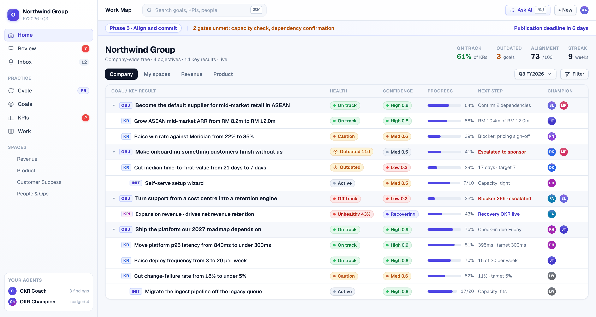
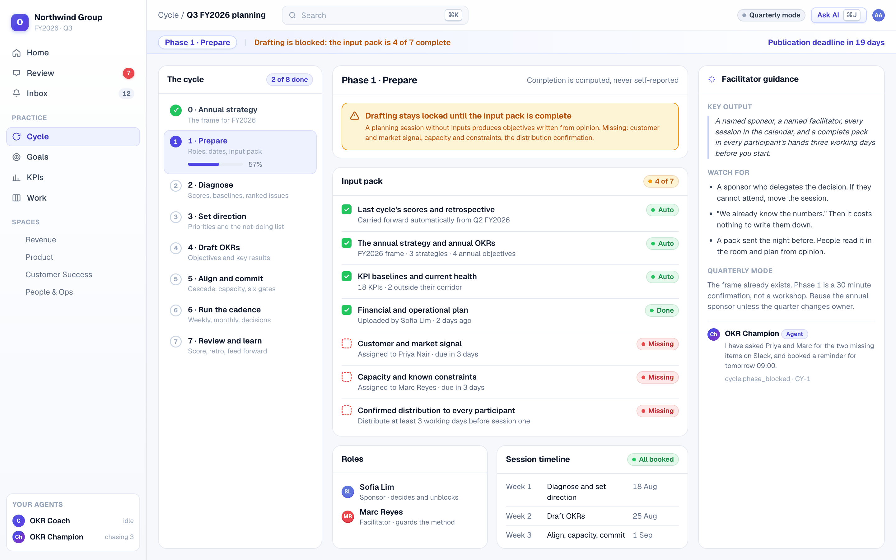
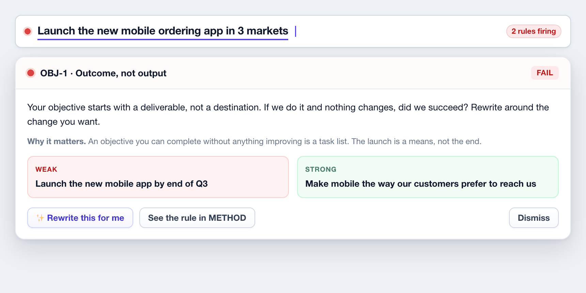
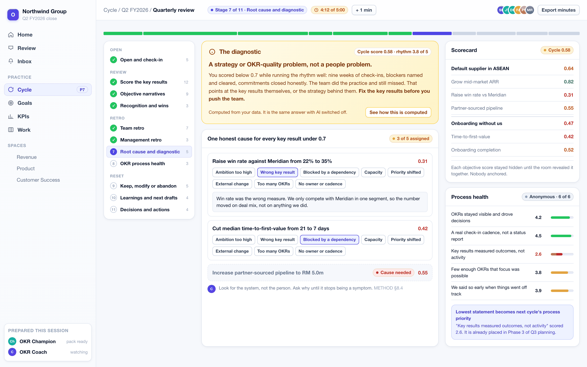
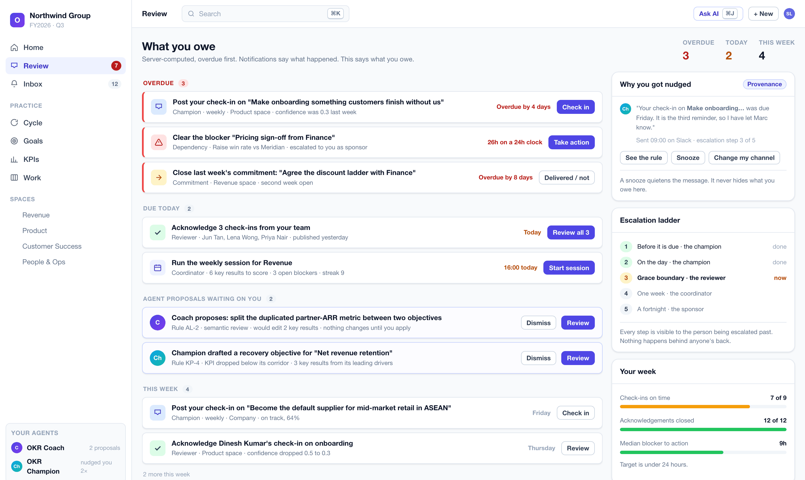
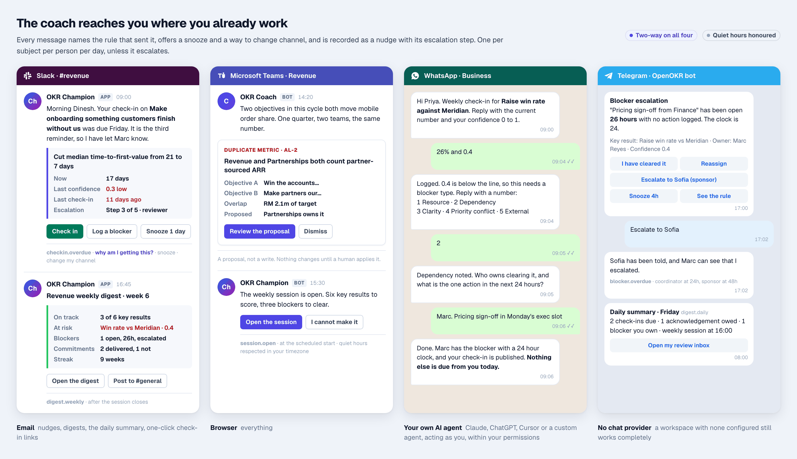

Most organisations do not fail at OKRs because their software was bad. They fail because the practice never happened. Somebody wrote objectives in a spreadsheet in January, nobody checked in by March, and the quarterly review was a meeting where everyone agreed things had gone reasonably well.

**OpenOKR puts the practice inside the product, and makes the product active.** The full OKR method ships as executable rules: a guided eight-phase cycle, twenty quality checks that run as you type, six hard publish gates, an alignment health score, KPI health corridors with automatic recovery objectives, two timed session formats, and a diagnostic at the close. Two AI teammates work that practice alongside the organisation. The **OKR Coach** guards quality. The **OKR Champion** guards the rhythm. They initiate, escalate and propose, in the browser, in Slack, Microsoft Teams, WhatsApp and Telegram, by email, and through whatever AI agent the user already runs.

| | |
|---|---|
| **Category** | Goal management and OKR practice software |
| **Difference** | The method is executable code, not a template. The software initiates instead of waiting |
| **Licence** | AGPL-3.0, open source, nothing feature-gated |
| **Deployment** | Self-hosted (Docker Compose or Helm) and managed cloud, from one release |
| **AI** | Bring your own provider. Every rule, nudge, gate and diagnostic still works with AI switched off |
| **Reach** | Browser, email, Slack, Microsoft Teams, WhatsApp, Telegram, and any external AI agent |
| **Status** | Design and specification complete. Eight delivery phases, 104 scoped tasks |
| **Document date** | August 2026 |

```{=openxml}
<w:p><w:r><w:br w:type="page"/></w:r></w:p>
```

# Contents

| Section | What it covers |
|---|---|
| **1. The problem** | Why OKR programmes die, and why current software does not stop it |
| **2. What OpenOKR is** | The two differences: an executable method, and software that initiates |
| **3. Who it is for** | Nine reader types and the organisations this fits |
| **4. The method, built in** | The guided cycle, live quality checks, publish gates, alignment, KPI recovery, and both session formats, with screens |
| **5. Accountability that reaches people** | The review inbox, and the coach in Slack, Teams, WhatsApp and Telegram |
| **6. Strengths and benefits** | What no other OKR tool does, what each stakeholder gets, and the outcomes we are designing for |
| **7. The complete module inventory** | Every module across six pillars, and what is deliberately deferred |
| **8. How it is built** | Architecture principles and the security posture, in brief |
| **9. How it runs** | Self-hosted and managed cloud, from one release |
| **10. Open source and licensing** | AGPL-3.0, the contributor agreement, and our position on methodology rights |
| **11. Status and roadmap** | Eight phases, 104 tasks, and the principal risk we are managing |
| **12. Working with us** | Three tracks: methodology partner, investor, design partner |
| **Appendix** | The twenty quality rules in full |

```{=openxml}
<w:p><w:r><w:br w:type="page"/></w:r></w:p>
```

# 1. The problem

The practice that makes OKRs work is well understood and has been for twenty years. Run a proper planning cycle. Refuse to draft without evidence. Check every objective and key result against a quality bar before committing a quarter to it. Align by contribution rather than by copying. Hold a short weekly check-in that produces decisions instead of status. Give every blocker an owner and twenty-four hours. Close the quarter with evidence and learn from it.

None of that lives in most software. It lives in a consultant's slide deck, and it stops when the consultant leaves.

What the market offers instead falls into three groups, and each fails the same way.

| What organisations use today | Why the practice still dies |
|---|---|
| **Spreadsheets** | No cadence, no accountability, no quality bar. Nobody is ever told anything |
| **Conventional OKR trackers** | A database with a progress bar. They store objectives faithfully and are entirely passive. They will happily hold a badly written key result for a whole quarter without comment |
| **Consulting and training** | The method is real, but it walks out of the door with the consultant. There is nothing to enforce it on a wet Tuesday in week six |

The result is a well-documented failure pattern. Objectives are written as project plans. Key results measure activity instead of impact. Nothing has a baseline, so nothing can be scored. Teams commit to more than they can deliver and never record what they cut. Check-ins stop by week five. Blockers sit unowned. The quarterly review becomes a presentation rather than a diagnosis, and the next quarter starts from a blank page as if nothing had been learned.

Every one of those is a rule that could have been enforced, a question that could have been asked at the right moment, and a person who could have been told. That is the product.

# 2. What OpenOKR is

Two things make it different, and every design decision serves one of them.

## 2.1 The method is in the product

The OKR practice canon is written down as a single authoritative specification and compiled into a pure software library with no database, no network and no AI dependency. It holds the eight-phase cycle, the scoring and confidence bands, the twenty quality rules with their word lists and coaching prompts, the six publish gates, the alignment scoring arithmetic, the KPI health corridors, the blocker and root-cause taxonomies, both session agendas, and the closing diagnostic.

Because it is a pure library, the same rules run in four places at once: in the browser as a user types, on the server before any write is accepted, inside the AI agents, and in the data importer. A conformance suite fails the build when the specification and the code disagree, so the product cannot drift away from the method.

Every coaching message the product sends carries a rule key that resolves back to the specification. A user can open the rule and argue with it. Nothing is a mysterious red dot.

## 2.2 The product is active

Two agent members ship with every workspace. They are members, not features: they have names, they appear in feeds, they can be mentioned, and they are accountable.

| Agent | What it owns | What it actually does |
|---|---|---|
| **OKR Coach** | Quality and practice | Reviews every draft against the twenty rules. Runs a nightly semantic sweep for duplicated metrics, better parents and hidden dependencies. Speaks up when the not-doing list is empty at the end of direction setting, when nothing was cut at the capacity check, when a goal is reported on track but its key results have not moved in a month, when the forecast says a key result will miss before anyone admits it, and when the scores cluster suspiciously near perfect at the close |
| **OKR Champion** | Rhythm and momentum | Reminds the champion before a check-in is due, on the day, and daily after. Escalates to the reviewer at the grace boundary, the coordinator at a week and the sponsor at a fortnight, always visibly to the person being escalated past. Runs the blocker clock with a warning at twenty hours and an escalation at twenty-four. Opens and closes the weekly session, assembles the digest, keeps the streak, watches every KPI corridor, and drafts the recovery objective when one drops out of range |

Both are deterministic first. With the AI provider switched off, the product still nudges, escalates, scores, gates, checks quality and computes the diagnostic, because those are real rules in real code rather than prompts. AI adds drafting, rewriting, semantic judgement and natural language. It never makes the decision.

Both propose by default. Every write an agent wants to make becomes a proposal in a human's review queue. Direct writes require an explicit, narrow, per-agent opt-in, and a sandbox mode commits nothing at all.

# 3. Who it is for

| Reader | What OpenOKR gives them |
|---|---|
| **Team member** | One place, or one chat message, that says what they owe this week, and lets them do it in under a minute |
| **Champion (goal owner)** | A composer that explains why a key result is weak while it is being written, a check-in the coach has already drafted from real activity, and a clear view of what is blocking them |
| **Reviewer or manager** | Every check-in from their people in one queue for a one-click acknowledgement, with stale and at-risk work impossible to miss |
| **Coordinator** | A weekly session the product runs for them: confidence, blockers with owners and clocks, commitments, a digest, and a streak that makes the habit visible |
| **Facilitator** | A guided cycle that knows which phase it is in and what is blocking it, and a sixty-minute quarterly review with a timer, a scoring reveal and exportable minutes |
| **Executive or sponsor** | The whole organisation on one map, escalations that arrive before things are unrecoverable, and a diagnostic at the close that says what to actually fix |
| **OKR lead or PMO** | Cycles across the organisation, KPI driver trees with recovery objectives, alignment health with named gaps, and everything exportable |
| **Administrator** | Members, access, single sign-on, backups with tested restores, a tamper-evident audit log, AI governance with hard cost caps, and a system built to pass a security review |
| **An external AI agent** | A proper consented sign-in, so a user's own Claude, ChatGPT, Cursor or custom agent works as that user, within their permissions, fully audited |

**Organisation types it fits:** companies of any size that want the OKR practice and not just an OKR database; universities, government bodies and regulated sectors that must self-host and prove compliance; consultancies and training institutes running the method for clients; and any team that would rather own its tools than rent them.

```{=openxml}
<w:p><w:r><w:br w:type="page"/></w:r></w:p>
```

# 4. The method, built in

## 4.1 The Work Map is the front door

One company-wide tree of goals, key results, initiatives and the KPIs that measure them. Every row carries the same contract: health, staleness, confidence, progress, champion, next step and timeframe. Staleness overrides reported health everywhere it appears, so nobody can hand-paint a goal green.

{width=6.5in}

## 4.2 The guided cycle

Every cycle runs eight phases with **computed** completion, not self-reported ticks. The product knows which phase it is in, what is missing, who owes what, and how many weeks remain before the publication deadline. Annual cycles set the frame. Quarterly cycles revalidate that frame in thirty to sixty minutes and set the quarter's OKRs inside it.

| Phase | What happens | The gate |
|---|---|---|
| **0. Annual strategy** | Mission, vision, mid-term strategy, two to five annual strategies, up to five annual objectives, and the year's not-doing list | The frame exists and is agreed |
| **1. Prepare** | Name a sponsor and a facilitator, book every session, gather the seven-item input pack | Drafting is refused until the pack is complete and distributed |
| **2. Diagnose** | Score the previous cycle, read the KPI baselines, rank five to ten strategic issues by impact | The prior cycle is scored, or this is declared a first cycle |
| **3. Set direction** | Three to five priorities, each with a statement of what will be measurably different in twelve months. Then the not-doing list | The not-doing list is written. The product will not skip it |
| **4. Draft OKRs** | Write the objectives and key results, with twenty rules checking every line live | Every key result passes its checks |
| **5. Align and commit** | Map contribution, register dependencies, check capacity, clear six publish gates | All six gates green, or no publication |
| **6. Run the cadence** | Weekly check-ins, monthly reviews, a decision log, one optional mid-cycle calibration | Sessions are booked for the whole cycle |
| **7. Review and learn** | Score, retro, diagnose, and feed everything into the next cycle automatically | Every objective closed deliberately |

{width=6.5in}

A planning session without inputs produces objectives written from opinion. That is why the block exists, and why it is a rule rather than a suggestion.

## 4.3 Quality at the point of writing

Twenty rules check every objective and key result as it is typed. Each returns pass, warn or fail with a specific coaching prompt, the reason it matters, and a weak-versus-strong example. The set carries a live strength score.

{width=6.5in}

Some of what it catches:

- An objective that starts with "launch". If we launch it and nothing changes, did we succeed?
- Numbers in the objective. Metrics belong in the key results.
- A key result with a target but no baseline. Without the "from", movement cannot be proved.
- "Hold twelve customer interviews." That is activity. What are the interviews for? Measure that.
- Every key result lagging. The team will only find out at the end. Add a leading indicator.
- Average confidence above ninety percent at drafting. That is sandbagging, not a stretch.
- An objective aligned to nothing. Name the priority it moves forward, or rethink it.

Each verdict opens into the rule itself, with the reason and a worked example. Coaching is arguable by design.

{width=4.7in}

## 4.4 Six publish gates, enforced

Six conditions are hard. A set that fails any one of them cannot be published, and the publish control is disabled with the reason stated rather than silently inert.

1. Every objective has a title, a named champion and a named reviewer.
2. Every key result passes its checks.
3. Alignment is mapped. Each objective states what it contributes to.
4. Every dependency is confirmed, or logged with a named risk owner.
5. Capacity is checked, nothing is left exceeding, and the cuts are recorded.
6. A publication date is set before day one of the cycle.

{width=6.5in}

Gate five is the one most organisations have never had. A plan where nothing was cut is a plan that has not been made.

## 4.5 Alignment that means something

Vertical alignment is contribution, not copying. Horizontal alignment is a dependency that both teams know about. The product scores alignment health and names every gap, and the Coach adds the findings that structure alone cannot see.

{width=6.5in}

## 4.6 KPI health corridors and recovery objectives

KPIs describe the health of the business. OKRs describe what is being changed about it. The product holds both, and connects them.

Every KPI sits in a health corridor: at or above ninety percent of target is healthy, seventy to eighty-nine is watch, below seventy is unhealthy. When a KPI turns unhealthy, OpenOKR drafts a **recovery objective**, one key result per leading child driver. The KPI then reads "recovering", and its effective health rises with the recovery's progress, so the fix is visible before the lagging number catches up.

{width=6.5in}

## 4.7 The weekly rhythm

Fifteen to thirty minutes, four steps, run by the product rather than remembered by a person.

1. **Confidence round.** Every key result scored from 0.0 to 1.0. Where the team votes, everyone submits privately and the votes reveal together, so nobody anchors on the champion. The champion writes one or two lines of what changed. Facts, not feelings.
2. **Diagnose what is low.** High and medium confidence moves on without discussion. Every low score gets a blocker type from a five-item taxonomy, a named owner and one concrete action within twenty-four hours. Anything at or below 0.3 escalates to management the same day.
3. **Commitments.** Last week's are closed out loud, delivered or not, with no negotiation. This week's are set: two or three moves that will actually shift a key result.
4. **Digest.** Generated, edited by the coordinator, posted to the team's channel.

It ends with a streak: the number of consecutive weeks the team held the session. A skipped week breaks it, and nothing else does.

{width=6.5in}

## 4.8 The quarterly review, and the diagnostic

Sixty minutes, three acts, eleven timed stages, ending in exported minutes and an automatic feed-forward into the next cycle. A room pulse comes first, because steady rooms round their numbers up. Objective scores stay hidden until the room reveals them together. Every key result below 0.7 gets exactly one honest cause from an eight-item taxonomy. Five statements of process health are scored anonymously, and the lowest becomes next quarter's process priority.

Then the diagnostic, which is the most valuable output of the whole session:

| The situation | What it means | What to do |
|---|---|---|
| Cycle score 0.7 or above | Results delivered | The question is not effort. It is whether the ambition was high enough to be worth the quarter |
| Below 0.7, rhythm strong | A strategy or OKR-quality problem | The team ran the practice and still missed. Fix the key results, not the people |
| Below 0.7, rhythm weak | A cadence problem | Restore the weekly check-in before rewriting a single objective |

{width=6.5in}

Nothing carries over by default. Every objective is closed deliberately as keep, modify or abandon, with a reason. Scores become the next cycle's phase-two scoring list, carry-forward items become ranked strategic issues that must survive prioritisation on their merits, and learnings join the next input pack.

```{=openxml}
<w:p><w:r><w:br w:type="page"/></w:r></w:p>
```

# 5. Accountability that reaches people

## 5.1 The review inbox

Notifications say what happened. The review inbox says what a person owes. It is computed on the server, ordered overdue first, and drives a live badge: check-ins due as champion, acknowledgements owed as reviewer, blockers owned, commitments due, sessions to run, and agent proposals awaiting a decision.

{width=6.5in}

## 5.2 The coach reaches people where they already work

A coach that only exists in a browser tab is not active. Every channel is two-way: nudges out, and real work in.

{width=6.5in}

Every proactive message is a recorded row with a rule key, a channel, an escalation step and a suppression reason when suppressed. Messages deduplicate to one per subject per person per day unless the escalation step increases. Quiet hours are honoured in each member's own timezone. A workspace with no chat provider connected still works completely, because email and the browser cover everything.

# 6. Strengths and benefits

## 6.1 The five things no other OKR tool does

| | Why it matters commercially |
|---|---|
| **The method is executable, not documentation** | Competitors ship templates and help articles. We ship rules that run on every keystroke and refuse a bad publish. A customer cannot quietly stop doing the practice |
| **The software initiates** | Every other tool waits to be visited. Ours arrives in Slack on Friday morning, escalates the blocker that aged past its clock, and tells the sponsor before the quarter is unrecoverable |
| **It works with AI switched off** | The rules, nudges, escalations, gates, scores and the diagnostic are deterministic code. That makes it sellable into regulated, air-gapped and AI-sceptical buyers who would reject an LLM-dependent product outright |
| **It diagnoses, not just reports** | At the close it tells leadership whether a missed quarter was a cadence problem or a strategy problem. That is the single question every executive asks and no tracker answers |
| **Agent-native to the core** | Everything a human can do, an agent can do, through one permission-checked contract. A customer's own Claude or ChatGPT becomes a first-class user rather than a scraping workaround |

## 6.2 What each stakeholder gets

**For a methodology institute or consultancy.** The practice becomes enforceable after the engagement ends. Every rule, band, corridor, taxonomy and agenda lives in one specification document that is versioned, auditable and separable from the code. Coaching prompts, rule names and band labels are translatable strings. A partner can see exactly what the product teaches, and disagree with it in a specific place rather than in general. Clients who buy training keep doing the practice, which is the thing training normally fails at.

**For an investor.** A category with real budget, sold today mostly as passive databases. Open source removes the top of the funnel cost and makes the enterprise security review a non-event, because the buyer can read the code. AGPL protects against a hyperscaler reselling it. The managed cloud sells operation rather than features, so the self-hosted community and the paying customers are the same product and the same release, with no feature-gate resentment and no second codebase. The agent layer is the durable moat: the rules, the trigger catalogue and the escalation ladder are the accumulated method, not a prompt anyone can copy.

**For an early customer.** Setup to first check-in in under fifteen minutes. The data stays on the customer's own servers if they want it there, in their own country, with no seat limit and no feature gate. Existing goals import from a spreadsheet with an AI-assisted column mapper and a dry run. The whole workspace exports to an encrypted, checksummed archive at any time. Nothing about the product creates lock-in, which is precisely why it is easy to say yes to.

**For an IT or security function.** Tenant isolation is enforced inside the database, not in application code. Every read of a protected object goes through one access checkpoint. Every write is one transaction that commits the change, its audit row and its outbox row together. The audit log is append-only with cryptographic tamper evidence and one-click chain verification. AI provider keys are envelope-encrypted, decrypted server-side only and never logged. The whole product runs air-gapped with a local model or no model at all.

## 6.3 Measurable outcomes we are designing for

| Leading indicator | Target |
|---|---|
| New team from install to first published check-in | Under 15 minutes |
| Due check-ins submitted on time in a pilot cohort | 70% or better |
| Median OKR strength score at publication | Above 75% |
| Median time from a blocker being logged to its next action | Under 24 hours |
| Active spaces holding a six-week or longer rhythm streak | Half or more |

```{=openxml}
<w:p><w:r><w:br w:type="page"/></w:r></w:p>
```

# 7. The complete module inventory

Everything below is in scope for version one unless marked otherwise. Nothing is gated behind a paid tier.

## Pillar A: The OKR core

| Module | What it does |
|---|---|
| **Cycles and the planning workflow** | Annual and quarterly cycles, the eight guided phases with computed completion, sponsor and facilitator roles, session dates, publication deadline, the seven-item input pack with distribution tracking, prior-cycle scoring, baseline health, ranked strategic issues, priorities with twelve-month success statements, the not-doing list, the six publish gates, and the automatic feed-forward at close |
| **Goals and key results** | Objectives owned by the workspace, a space or a person. Key results as direction-aware numeric ranges (increase, reduce, maintain, move) with baseline, target, unit, weight, leading or lagging type, owner, due date, confidence, full value history and a trend forecast. Explicit close with an outcome and a retrospective, reopenable |
| **Alignment** | The vertical cascade across company, department, team and individual levels, plus horizontal dependency links between teams. The alignment health score with linked gaps. The dependency register with confirmation and named risk owners. The capacity check with a mandatory record of what was cut |
| **KPIs and KPI trees** | Categories, per-KPI frequency, unit, direction, type and tier. A keyboard-first grid of periods by KPIs. Parent and child driver trees. Calculated KPIs from a typed formula over other KPIs with cross-frequency aggregation and cascade recompute. KPI-backed key results |
| **Health corridors and recovery OKRs** | Per-KPI corridors, automatic recovery objectives drafted from an unhealthy KPI's leading drivers, effective health that rises with recovery progress, and a cross-tree recovery board |
| **Check-ins** | Status, confidence, a required written narrative and an immutable snapshot of every key result value with its previous value. Draft then publish. Optional private team confidence voting revealed together |
| **Scorecard** | Per owner and per cycle rollup on archive, score bands and portfolio verdicts, trends across cycles, export. Ships off by default |

## Pillar B: The rhythm

| Module | What it does |
|---|---|
| **Weekly check-in session** | The four-step ritual run inside the product: confidence round with dial and bands, team voting, blocker diagnosis, commitments, the generated digest, the rhythm streak, the twelve-week confidence trend and the open-blocker board with ages |
| **Blockers** | A five-type taxonomy (resource, dependency, clarity, priority conflict, external), an owner, a next action, a twenty-four hour clock, escalation at 0.3 confidence and below, and an aging board |
| **Commitments** | Weekly, owned, linked to a key result, closed as delivered or not with no negotiation |
| **Monthly review** | Trend per objective, dependency and risk log, resource and priority shifts, and a decision log where every decision names the key result it affects |
| **Quarterly review session** | Eleven timed stages across three acts: room pulse, hidden-then-revealed scoring, round-robin narratives, recognition, dot-voted team retro, the four management-retro questions, the eight-cause root-cause picker, five-statement anonymous process health, the rhythm diagnostic, keep/modify/abandon, learnings and next-cycle drafts, decisions and actions, and exported minutes |
| **Mid-cycle calibration** | Once per cycle, only for a verifiable external change, with a written reason |
| **Cadence and staleness** | Per-goal frequency anchored to a company-chosen day, exactly one champion and one reviewer, computed due dates, a grace window, and an outdated state that overrides reported health everywhere |
| **Review inbox and digests** | The server-computed "what I owe" page, plus daily and weekly digests in each member's own timezone and channel |

## Pillar C: The work

Deliberately OKR-shaped. Enough to answer "what is actually moving this key result", not a project management suite.

| Module | What it does |
|---|---|
| **Initiatives** | The work that moves a key result: owner, dates, status, confidence and a capacity verdict. The capacity gate reads from these, which is why "nothing was cut" is a gate failure |
| **Tasks and the OKR board** | Tasks with assignees, status, due date and checklist, each optionally linked to a key result. A kanban board across a space, an initiative or a key result, with drag, live presence and concurrency-safe ordering. Progress derived from linked completed tasks is shown beside the measured number, never instead of it |
| **Documents** | Rich documents attached to a goal, key result, initiative, cycle, session or space. Draft then publish, version history with a visual difference, comments and reactions |
| **Files** | Attachments on any of the above, with previews, quotas and an optional scan hook |

## Pillar D: Coaching and AI

| Module | What it does |
|---|---|
| **The Draft Coach** | The twenty-rule engine, deterministic and always available with AI off, enriched by AI for rewrite suggestions and semantic judgement when a provider is configured |
| **The OKR Coach agent** | Quality and practice: draft review, the nightly semantic sweep, reported-health-versus-data divergence, sandbagging at draft and at close, and the rhythm diagnostic |
| **The OKR Champion agent** | Rhythm and momentum: check-in reminders and the five-step escalation ladder, the blocker clock, acknowledgement chasing, opening and closing the weekly session, digests, the quarterly review pack, KPI corridor watching and recovery OKR proposals |
| **Agent governance** | Least-privilege bindings on named spaces and goals only, propose-by-default with a review queue, sandbox mode, per-step metering, hard cost caps that halt a run mid-flight, versioned instructions, and a readable run log for every execution |
| **Nudge engine** | Every proactive message is a recorded row with a rule key, channel, escalation step and suppression reason. Deduplication, quiet hours per member timezone, snooze, and a provenance panel on every message |
| **Assists everywhere** | Propose-then-confirm accelerators over a complete manual path: draft objectives and key results from an ambition, rate and improve a draft, suggest metrics, targets, units and alignment parents, draft an overdue check-in from real activity, draft the retrospective from check-in history, suggest KPIs, thresholds and formulas from plain language, narrate a KPI trend and flag anomalies, draft the digest and the minutes, summarise a thread, decompose a key result into initiatives and tasks, and turn a sentence into a filtered list |
| **Copilot** | A side panel that answers grounded in workspace data with permission-filtered citations and proposes actions for confirmation. Long runs execute in the background and stream back |
| **Bring your own AI** | Anthropic, OpenAI, Google, OpenRouter, Ollama or any OpenAI-compatible endpoint. Keys at deployment, workspace or per-user level, envelope-encrypted. A validated model catalogue with capability tiers, per-feature toggles, per-token cost metering, quotas, hard caps, versioned prompts, egress controls, and a zero-egress guarantee on local providers |

## Pillar E: Channels and reach

| Channel | Version one capability |
|---|---|
| **Browser** | Everything |
| **Email** | Nudges, digests, the daily summary, invitations, one-click check-in links |
| **Slack** | Two-way. Nudges, blocker escalations, digests, and commands to check in, log a blocker, ask the coach and read a goal |
| **Microsoft Teams** | Two-way, the same surface in adaptive cards |
| **WhatsApp** | Two-way via the WhatsApp Business API. Template nudges out, conversational check-in and blocker capture in |
| **Telegram** | Two-way bot, the same surface with inline buttons |
| **External AI agents** | Any external agent drives OpenOKR as the authenticated user, through a consent screen, within that user's permissions, fully audited. A tool catalogue covering the whole product with read, write and destructive safety classes |

Every inbound message resolves to a workspace member and runs through the same permission checks as a click in the browser.

## Pillar F: Platform

| Module | What it does |
|---|---|
| **Spaces** | Team homes with their own goals, sessions, documents, members and access scope |
| **People and organisation** | Per-workspace profiles, a manager chain and org chart, a directory, suspend and restore, guests, invitations by email and reusable links with domain rules, and trusted-domain auto-join |
| **Access control** | Relationship-based per-object access on top of database-enforced tenant isolation, through one enforcement point shared by the browser, the API, external agents and the built-in agents |
| **Collaboration** | Comments, reactions, mentions, subscriptions and notifications everywhere, with per-reason routing, per-channel delivery, digest windows, and a compose-time preview of who will be notified |
| **Activity feed** | Typed, human-readable, permission-filtered and live, at workspace, space, goal and profile scope. Separate from the compliance audit log |
| **Search and command palette** | Entity jump, actions and full-text search across everything a member may see. Semantic search arrives with the AI layer |
| **Administration** | Workspace settings, members and access, cycle and rhythm defaults, thresholds, coaching strictness, terminology labels, notification and channel defaults, security, branding, the audit log with chain verification, a read-only freeze switch, backups, import and export |
| **Portability** | Signed, encrypted, checksummed workspace export and dry-run import between any two OpenOKR instances, self-host and cloud in both directions |
| **Importers** | A generic spreadsheet importer for goals, key results, KPIs and records, initiatives and tasks, with template downloads, an AI-assisted column mapper, a dry-run preview and a per-row error report. Plus a dedicated read-only FlowyTeam importer. Both idempotent on re-run, both producing a reconciliation report, with every derived value recomputed rather than trusted |
| **Accessibility and languages** | WCAG 2.1 AA target with automated checks on every screen, keyboard paths for every action including drag alternatives, English and Bahasa Melayu at launch, and full internationalisation from day one |

## Deferred past version one

Designed for, not blocked, and never required: custom fields, configurable statuses and workflows, a saved-query language and view builder, Gantt with automatic dependency scheduling, time and cost tracking, sprints and story points, meetings beyond the OKR sessions, calendar two-way sync, additional chat channels, real-time co-editing of documents, and native mobile applications. The responsive web application and the chat channels cover mobile in version one.

```{=openxml}
<w:p><w:r><w:br w:type="page"/></w:r></w:p>
```

# 8. How it is built, in brief

A single codebase and a single tagged release. TypeScript throughout, Next.js and React on the front end, PostgreSQL as the only required service, and a strict separation between the method, the domain and the outside world.

| Principle | What it buys |
|---|---|
| **The method is a pure library** | The same rules run in the browser, on the server, in the agents and in the importer. A conformance suite fails the build when the specification and the code disagree |
| **One write path** | Every write is a single transaction that commits the domain change, its access bindings, the activity row, the audit row and the outbox row together. Side effects are only ever enqueued inside that transaction, so nothing is half-done |
| **Tenant isolation in the database** | Every business table carries a workspace identifier and a row-level security policy shipped in the same migration. Application code cannot leak across tenants even if it is wrong |
| **One authorisation checkpoint** | Every read of a protected object goes through a single access-aware getter that returns not-found on forbidden. No per-endpoint checks, and the interface never hides anything the API would reveal |
| **One contract, many surfaces** | Reads and writes are defined once in an action registry with schemas and a required access level. The internal client, the public REST API, the OpenAPI document, the command line, the agent tool catalogue and the chat commands are all generated projections of it, checked for drift in continuous integration |
| **Vendor code is quarantined** | No cloud, queue, mail, chat or AI vendor library appears outside one adapters package. Every runtime-sensitive capability sits behind a port, which is what makes air-gapped operation and provider choice real rather than aspirational |

**Security posture.** Authentication with passkeys and one-time passwords from day one, session tokens hashed at rest, scoped and expiring tokens for agents, an append-only audit log with cryptographic tamper evidence and one-click chain verification, envelope-encrypted provider keys and channel credentials that are never logged, signature verification on every inbound channel payload, sanitising allow-list rendering of all rich text including email and exports, and forward-only migrations with data backfills kept separate from schema changes.

# 9. How it runs

| Option | Who it suits | What it takes |
|---|---|---|
| **Self-hosted, one server** | Any organisation that wants its data on its own machines | One Docker Compose file and a first-run web wizard that generates every secret and tests every connection. Target: under 30 minutes |
| **Self-hosted, Kubernetes** | Universities, government and large enterprises | A Helm chart, the customer's own PostgreSQL, single sign-on and backups |
| **Managed cloud** | Teams that do not want to run anything | Sign up, name a workspace, start |

Both are the same release. The cloud is that container under our operation plus a tenant lifecycle layer: signup and provisioning, plans and seat limits behind a flag, an operator console, per-tenant limits, and time-boxed support access that is visible to the customer. It is not a different product and not a different runtime.

**Self-host is never seat-limited and never feature-gated. The cloud sells operation, not features.**

**Air-gap capable.** No feature hard-depends on an external service. AI points at a local model or is switched off. Channels are optional. Telemetry is opt-in. Assets are self-hosted.

# 10. Open source and licensing

The application code is **AGPL-3.0** with a lightweight contributor licence agreement.

- AGPL stops a third party from taking the code and selling a closed hosted version. Anyone who modifies it and offers it over a network must publish their changes.
- It is safe for the buyers we want. An organisation that self-hosts for its own staff takes on no obligations at all.
- The contributor agreement preserves the right to run a paid cloud and to relax the licence later. That is a one-way door, and it is deliberately left open.

**On the methodology.** OpenOKR implements OKR practice as method: rules, thresholds, taxonomies, bands and agendas, written in our own words. No third party's copy, branding, typefaces, logos or course material appears anywhere in the product or in this document. Where a methodology partner holds rights in specific expression or wishes to be credited, we would rather agree that explicitly than assume either way.

# 11. Status and roadmap

The product is fully specified and not yet built. The specification set covers requirements, architecture, the method canon, the technical design including the complete database schema, the AI and agent design, forty screen specifications, and an implementation plan of **104 scoped tasks across eight phases**, each with acceptance criteria and a test plan.

| Phase | What lands |
|---|---|
| **1. Foundation** | Monorepo, continuous integration, database with the tenant floor, adapter ports and the transactional outbox, authentication, workspaces and members, the single write pipeline and audit spine, the Compose and Helm targets |
| **2. Platform and agent spine** | The access model, people and organisation, notifications, the activity feed, the design system and rich text editor, and the AI foundation: provider port, bring-your-own-key, model catalogue, metering with hard caps, and the agent runtime with sandbox and proposal envelopes |
| **3. The OKR core** | Spaces, cycles and the guided workflow, goals and key results, the scoring, health and cadence engines, check-ins, the review inbox, alignment, KPIs with driver trees and recovery, and the Work Map |
| **4. The coaching layer** | The method library and its full rule catalogue, the Draft Coach, both agents with the trigger and escalation catalogue, the weekly session, the monthly review, the quarterly review with the diagnostic and minutes, and the copilot |
| **5. Reach** | Slack, Microsoft Teams, WhatsApp and Telegram, two-way conversational check-in and blocker capture, the external agent server and tool catalogue, initiatives, tasks and the board, documents and search |
| **6. Data** | The spreadsheet importer with the AI-assisted mapper, the FlowyTeam importer, workspace export and import, and backups with restore drills |
| **7. Hardening** | Performance at scale, load and soak testing, the security review, the accessibility audit, and observability |
| **8. Cloud, enterprise and launch** | Tenant provisioning and the operator console, plans behind a flag, single sign-on and directory sync, audit export, the air-gap guide, documentation, the template gallery and the hosted demo |

The order is deliberate. The AI and agent foundation lands in phase two, with the platform, so the coaching layer can ship in phase four alongside the OKR core. An OKR tool where the coach arrives last is just another tracker.

**Principal risk we are managing.** A coaching engine that produces false positives is worse than no coaching at all, because people learn to dismiss it. The warn-versus-fail line on all twenty rules will be tuned against a corpus of real, anonymised OKRs before launch, and assembling that corpus is a named deliverable of the coaching phase's design gate. This is the single place where a methodology partner would add the most value.

# 12. Working with us

Three different conversations, depending on who is reading.

| If you are | What we are asking for | What you get |
|---|---|---|
| **A methodology institute or practitioner** | Review the method specification, and challenge any rule, threshold, band or agenda you think is wrong. Help us assemble the tuning corpus of real OKRs | Your practice becomes enforceable software that keeps working after the engagement ends, with every rule attributable, versioned and arguable |
| **An investor** | A conversation about the category, the open source route to market, and the plan to first revenue | A fully specified product with an unusually defensible core, in a market currently served by passive databases |
| **An early customer or design partner** | Run a real quarter on it, with us, and tell us where the coaching is wrong | Free use for the pilot, direct influence on the rules and the roadmap, and no lock-in of any kind because the whole workspace exports at any time |

Everything in this document is specified in detail in the project's planning set, which is available on request in full.

```{=openxml}
<w:p><w:r><w:br w:type="page"/></w:r></w:p>
```

# Appendix: the twenty quality rules

Every rule below runs on every keystroke, returns pass, warn or fail, and carries a coaching prompt, the reason it matters and a weak-versus-strong example. Rules marked as a gate block publication.

| Rule | Checks | Gate |
|---|---|---|
| **OBJ-1** Outcome, not output | The objective names a change in state, not a deliverable. Fails on an output verb in the lead position | |
| **OBJ-2** Inspiring and directional | Qualitative, memorable, four to eighteen words, no digits | |
| **OBJ-3** Timebound | A cycle or an explicit timeframe. An OKR without a deadline is a wish | Yes |
| **OBJ-4** Owned | A named champion and a named reviewer | Yes |
| **OBJ-5** Counted | Warns above three objectives for a unit, fails above five at company level | |
| **KR-1** Count | Two to five key results per objective | |
| **KR-2** Measurable | Reads as "from X to Y". A target without a baseline cannot prove movement | Yes |
| **KR-3** Complete | Baseline, target, date and owner all present | Yes |
| **KR-4** Leading and lagging mix | At least one of each. All-lagging means finding out at the end | |
| **KR-5** Impact, not effort | Measures the impact, not the activity volume that produces it | Yes |
| **KR-6** Ambitious but honest | Judged on the set's average confidence. Flags both sandbagging and fantasy | |
| **KR-7** Direction set | One of increase, reduce, maintain or move | Yes |
| **AL-1** Supports a bigger priority | A parent, or a stated contribution of more than three words | Yes |
| **AL-2** One parent only | Exactly one parent goal or one parent key result, never both | |
| **AL-3** No level skip | A team goal aligns to a department goal, not straight to a company goal | |
| **AL-4** Company anchor | At least one company-level objective anchors the tree | |
| **AL-5** Dependencies declared | Every cross-team dependency confirmed by the providing team, or logged with a named risk owner | Yes |
| **AL-6** Not siloed | Flags a department whose whole subtree has no horizontal dependency anywhere |  |
| **CY-1 to CY-8** Cycle checks | Input pack complete and distributed; prior cycle scored; five to ten ranked strategic issues; three to five priorities with twelve-month success statements; the not-doing list written; capacity checked with nothing exceeding and the cuts recorded; every dependency confirmed or risk-owned; every check-in and review booked | Partly |

**Strength score** = (passes + half of warns) / total checks. Below 45% is red, 45 to 74% is amber, 75% and above is green. In strict mode, every warning becomes a failure.
